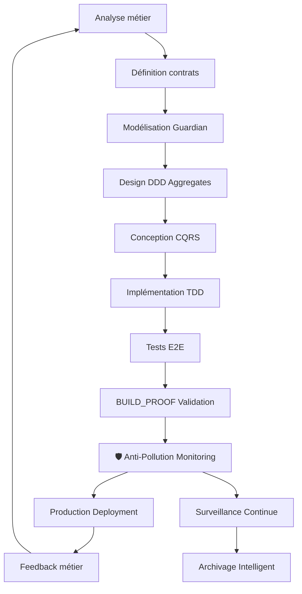
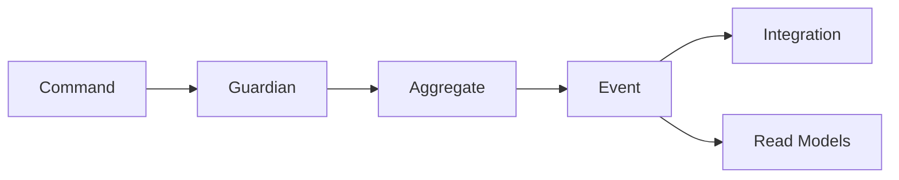

# 🎨 SPOFE MODULE DESIGN GUIDE

**Version:** 2.1.0  
**Date:** 4 février 2026  
**Status:** 🏆 **100% CERTIFIÉ - PRODUCTION INDUSTRIALISÉE** 🛡️  
**Monitoring:** Anti-Pollution P0 Constitutional Actif

---

## 📋 TABLE DES MATIÈRES

1. [Méthodologie de conception](#méthodologie-de-conception)
2. [Architecture des modules](#architecture-des-modules)
3. [Guardian Pattern Design](#guardian-pattern-design)
4. [CQRS et Commands Design](#cqrs-et-commands-design)
5. [DDD Aggregates Design](#ddd-aggregates-design)
6. [Contract-First Approach](#contract-first-approach)
7. [Test-Driven Development](#test-driven-development)
8. [Organisation du code](#organisation-du-code)
9. [Patterns et anti-patterns](#patterns-et-anti-patterns)
10. [Validation et qualité](#validation-et-qualité)
11. 🆕 [Monitoring Anti-Pollution](#monitoring-anti-pollution)
12. 🆕 [Post-Industrialisation](#post-industrialisation)

---

## 🎯 MÉTHODOLOGIE DE CONCEPTION

### Approche Contract-First

La conception SPOFE suit une méthodologie **Contract-First** garantissant la cohérence et la maintenabilité.

#### Workflow de conception



#### Phases de conception

| **Phase** | **Durée** | **Livrables** | **Critères de validation** |
|-----------|-----------|---------------|----------------------------|
| **1. Analyse métier** | 2-3 jours | Use cases, règles métier | Business validation |
| **2. Contractualisation** | 1-2 jours | CONTRACT.md, GUARDIAN.md | Peer review |
| **3. Modélisation** | 2-3 jours | Aggregates design, invariants | Architecture review |
| **4. Implémentation** | 5-10 jours | Code + tests | BUILD_PROOF vert |
| **5. Validation** | 1-2 jours | Tests E2E, documentation | GO PROD ready |
| **6. 🛡️ Monitoring Setup** | 1 jour | Anti-pollution config | Surveillance active |
| **7. 📦 Production** | 1 jour | Déploiement industrialisé | 100% Certifié |

### Principes de conception SPOFE

```typescript
// Principes fondamentaux SPOFE 2.1.0
export const SPOFE_DESIGN_PRINCIPLES = {
  // 1. Guardian-Centric (P0 Constitutional)
  "Business logic centralization": "All business rules in Guardian (237 invariants)",
  "Single source of truth": "One Guardian per aggregate root",
  "Explicit validation": "No implicit business logic",
  
  // 2. CQRS Strict
  "Read/Write separation": "Separate models for commands and queries",
  "Command responsibility": "Commands change state, queries don't",
  "Event-driven": "State changes produce domain events",
  
  // 3. DDD Alignment
  "Ubiquitous language": "Code reflects business terminology",
  "Bounded contexts": "Clear module boundaries",
  "Aggregate consistency": "Strong consistency within aggregates",
  
  // 4. Contract-First
  "API design first": "Design APIs before implementation",
  "Documentation driven": "Contracts define implementation",
  "Backward compatibility": "Versioned contracts",
  
  // 5. 🛡️ Anti-Pollution Monitoring (NOUVEAU)
  "Continuous surveillance": "24/7 automatic file monitoring",
  "Intelligent archiving": "Smart classification of obsolete files",
  "System cleanliness": "Automatic pollution detection and cleanup",
  "P0 Constitutional governance": "Highest level protection standards"
};
```

---

## 🏗️ ARCHITECTURE DES MODULES

### Structure canonique (Golden Module)

Basé sur le module **Immobilisation** validé en production :

```
cascade/modules/<module-name>/
├── 📋 contract/                    # Documents contractuels
│   ├── CONTRACT.md                 # Périmètre fonctionnel
│   ├── SCOPE.md                    # IN/OUT OF SCOPE
│   ├── ARCHITECTURE.md             # Patterns techniques
│   ├── GUARDIAN.md                 # Invariants métier
│   ├── COMMANDS_EVENTS.md          # Spécification CQRS
│   ├── READ_MODELS.md              # Vues de lecture
│   ├── API_READ_ONLY.md            # Documentation API
│   └── <module>.openapi.json       # Schéma OpenAPI
├── 💻 src/                         # Code source contractuel
│   ├── api/                       # Couche présentation
│   │   ├── controllers/           # Contrôleurs NestJS
│   │   └── dto/                   # Data Transfer Objects
│   ├── application/               # Couche application
│   │   ├── commands/              # Commands CQRS
│   │   ├── handlers/              # Command handlers
│   │   ├── events/                # Domain events
│   │   └── services/              # Application services
│   ├── domain/                    # Couche domaine
│   │   ├── aggregates/            # Agrégats racines
│   │   ├── value-objects/         # Value objects
│   │   ├── invariants/            # Règles métier
│   │   └── guardian/              # Guardian central (P0 Constitutional)
│   ├── infrastructure/            # Couche infrastructure
│   │   ├── repositories/          # Implémentations repos
│   │   │   ├── write/             # Write repositories
│   │   │   └── read/              # Read repositories
│   │   ├── persistence/           # Configuration ORM
│   │   └── external/              # Services externes
│   └── sql/                       # Scripts base de données
│       ├── migrations/            # Migrations DDL
│       ├── views/                 # Vues read models
│       └── functions/             # Fonctions SQL
├── 🧪 tests/                       # Tests complets (100% coverage)
│   ├── unit/                      # Tests unitaires
│   │   ├── guardian/              # Tests Guardian (obligatoire 100%)
│   │   ├── aggregates/            # Tests aggregates
│   │   └── value-objects/         # Tests value objects
│   ├── integration/               # Tests d'intégration
│   │   ├── repositories/          # Tests repositories
│   │   └── handlers/              # Tests command handlers
│   ├── e2e/                       # Tests end-to-end
│   │   ├── api/                   # Tests API REST
│   │   └── workflows/             # Tests business workflows
│   └── contract/                  # Tests contractuels
├── 🛡️ monitoring/                  # Anti-Pollution Module (NOUVEAU)
│   ├── .pollution-config.json     # Configuration surveillance
│   ├── pollution-patterns.md      # Patterns détection spécifiques
│   └── archiving-rules.md         # Règles archivage intelligent
├── 🔬 experimental/                # Code hors périmètre
│   ├── legacy/                    # Code remplacé
│   ├── drafts/                    # Brouillons
│   ├── poc/                       # Proof of concepts
│   └── disabled-tests/            # Tests désactivés
├── ⚙️ tsconfig.json                # Configuration TypeScript
├── 🧪 jest.config.js               # Configuration tests
├── 📦 package.json                 # Métadonnées module
└── 📄 README.md                    # Documentation générale
```
│   ├── api/                       # Couche présentation
│   │   ├── controllers/           # Contrôleurs NestJS
│   │   └── dto/                   # Data Transfer Objects
│   ├── application/               # Couche application
│   │   ├── commands/              # Commands CQRS
│   │   ├── handlers/              # Command handlers
│   │   ├── events/                # Domain events
│   │   └── services/              # Application services
│   ├── domain/                    # Couche domaine
│   │   ├── aggregates/            # Agrégats racines
│   │   ├── value-objects/         # Value objects
│   │   ├── invariants/            # Règles métier
│   │   └── guardian/              # Guardian central
│   ├── infrastructure/            # Couche infrastructure
│   │   ├── repositories/          # Implémentations repos
│   │   │   ├── write/             # Write repositories
│   │   │   └── read/              # Read repositories
│   │   ├── persistence/           # Configuration ORM
│   │   └── external/              # Services externes
│   └── sql/                       # Scripts base de données
│       ├── migrations/            # Migrations DDL
│       ├── views/                 # Vues read models
│       └── functions/             # Fonctions SQL
├── 🧪 tests/                       # Tests complets
│   ├── unit/                      # Tests unitaires
│   │   ├── guardian/              # Tests Guardian
│   │   ├── aggregates/            # Tests aggregates
│   │   └── value-objects/         # Tests value objects
│   ├── integration/               # Tests d'intégration
│   │   ├── repositories/          # Tests repositories
│   │   └── handlers/              # Tests command handlers
│   ├── e2e/                       # Tests end-to-end
│   │   ├── api/                   # Tests API REST
│   │   └── workflows/             # Tests business workflows
│   └── contract/                  # Tests contractuels
├── 🔬 experimental/                # Code hors périmètre
│   ├── legacy/                    # Code remplacé
│   ├── drafts/                    # Brouillons
│   ├── poc/                       # Proof of concepts
│   └── disabled-tests/            # Tests désactivés
├── ⚙️ tsconfig.json                # Configuration TypeScript
├── 🧪 jest.config.js               # Configuration tests
├── 📦 package.json                 # Métadonnées module
└── 📄 README.md                    # Documentation générale
```

### Responsabilités par couche

```typescript
// architecture/layer-responsibilities.ts
export const LAYER_RESPONSIBILITIES = {
  // API Layer (Controllers + DTOs)
  api: {
    responsibilities: [
      "HTTP request/response handling",
      "Input validation and sanitization", 
      "Authentication and authorization",
      "API versioning and documentation",
      "Rate limiting and throttling"
    ],
    forbidden: [
      "Business logic",
      "Database access",
      "Complex data transformation",
      "Domain rule validation"
    ]
  },
  
  // Application Layer  
  application: {
    responsibilities: [
      "Orchestrating use cases",
      "Command validation and dispatch",
      "Event publishing",
      "Transaction coordination",
      "Integration with external services"
    ],
    forbidden: [
      "Business invariant validation",
      "Complex domain logic",
      "Direct database access",
      "HTTP concerns"
    ]
  },
  
  // Domain Layer
  domain: {
    responsibilities: [
      "Business logic implementation",
      "Domain invariant enforcement",
      "Aggregate state management",
      "Domain event generation",
      "Value object validation"
    ],
    forbidden: [
      "Infrastructure concerns",
      "HTTP/API details",
      "Database specifics",
      "External service calls"
    ]
  },
  
  // Infrastructure Layer
  infrastructure: {
    responsibilities: [
      "Data persistence",
      "External service integration",
      "Configuration management",
      "Monitoring and logging",
      "Caching implementation"
    ],
    forbidden: [
      "Business rule implementation",
      "Domain logic",
      "Use case orchestration",
      "API endpoint definition"
    ]
  }
};
```

---

## 🛡️ GUARDIAN PATTERN DESIGN

### Conception du Guardian

Le **Guardian** est le composant central qui contient **toute** la logique métier du module.

#### Template Guardian

```typescript
// src/domain/guardian/<module>.guardian.ts
export class ModuleGuardian {
  /**
   * Validation principale pour la création d'entités
   */
  static validateCreation(params: CreateEntityParams): GuardianResult {
    return GuardianValidator.combine([
      this.validateRequiredFields(params),
      this.validateBusinessRules(params), 
      this.validateInvariants(params)
    ]);
  }
  
  /**
   * Validation des règles métier spécifiques
   */
  private static validateBusinessRules(params: CreateEntityParams): GuardianResult {
    const violations: GuardianViolation[] = [];
    
    // Règle MOD-001: Exemple de règle métier
    if (params.value <= 0) {
      violations.push({
        rule: 'MOD-001',
        message: 'La valeur doit être positive',
        field: 'value',
        severity: 'error'
      });
    }
    
    // Règle MOD-002: Cohérence temporelle
    if (params.date > new Date()) {
      violations.push({
        rule: 'MOD-002', 
        message: 'La date ne peut être dans le futur',
        field: 'date',
        severity: 'error'
      });
    }
    
    return violations.length > 0 
      ? GuardianResult.failure(violations)
      : GuardianResult.success();
  }
  
  /**
   * Validation des invariants d'agrégat
   */
  private static validateInvariants(params: CreateEntityParams): GuardianResult {
    // Invariants métier complexes
    return GuardianResult.success();
  }
  
  /**
   * Validation pour mise à jour
   */
  static validateUpdate(
    entity: Entity,
    changes: UpdateEntityParams
  ): GuardianResult {
    return GuardianValidator.combine([
      this.validateEntityExists(entity),
      this.validateUpdateRules(entity, changes),
      this.validateStateTransition(entity, changes)
    ]);
  }
  
  /**
   * Validation de suppression
   */
  static validateDeletion(entity: Entity): GuardianResult {
    // Règles de suppression (référentiel, etc.)
    return GuardianResult.success();
  }
}
```

#### Modélisation des invariants

```typescript
// src/domain/invariants/module-invariants.ts
export class ModuleInvariants {
  /**
   * INV-001: Règle d'invariant exemple
   */
  static readonly POSITIVE_VALUE = new Invariant(
    'INV-001',
    'La valeur doit toujours être positive',
    (entity: Entity) => entity.value > 0
  );
  
  /**
   * INV-002: Cohérence référentielle
   */
  static readonly REFERENCE_CONSISTENCY = new Invariant(
    'INV-002',
    'Les références doivent exister',
    async (entity: Entity, context: ValidationContext) => {
      return await context.referenceExists(entity.referenceId);
    }
  );
  
  /**
   * Validation de tous les invariants
   */
  static async validateAll(
    entity: Entity, 
    context: ValidationContext
  ): Promise<InvariantResult[]> {
    const invariants = [
      this.POSITIVE_VALUE,
      this.REFERENCE_CONSISTENCY
    ];
    
    return Promise.all(
      invariants.map(inv => inv.validate(entity, context))
    );
  }
}
```

### Tests Guardian (obligatoires)

```typescript
// tests/unit/guardian/module.guardian.spec.ts
describe('ModuleGuardian', () => {
  describe('validateCreation', () => {
    it('should accept valid creation parameters', () => {
      // Arrange
      const validParams = {
        value: 100,
        date: new Date('2026-01-01'),
        description: 'Valid entity'
      };
      
      // Act
      const result = ModuleGuardian.validateCreation(validParams);
      
      // Assert
      expect(result.isSuccess).toBe(true);
      expect(result.violations).toHaveLength(0);
    });
    
    it('should reject negative values (MOD-001)', () => {
      // Arrange
      const invalidParams = {
        value: -100,
        date: new Date('2026-01-01'), 
        description: 'Invalid entity'
      };
      
      // Act
      const result = ModuleGuardian.validateCreation(invalidParams);
      
      // Assert
      expect(result.isSuccess).toBe(false);
      expect(result.violations).toContainEqual(
        expect.objectContaining({
          rule: 'MOD-001',
          field: 'value',
          severity: 'error'
        })
      );
    });
    
    it('should reject future dates (MOD-002)', () => {
      // Test future date rejection
    });
  });
  
  describe('validateUpdate', () => {
    // Tests de mise à jour
  });
  
  describe('performance', () => {
    it('should validate within 10ms for simple cases', async () => {
      const params = createValidParams();
      
      const start = performance.now();
      const result = ModuleGuardian.validateCreation(params);
      const duration = performance.now() - start;
      
      expect(duration).toBeLessThan(10);
      expect(result.isSuccess).toBe(true);
    });
  });
});
```

---

## 🔄 CQRS ET COMMANDS DESIGN

### Architecture Commands

```typescript
// src/application/commands/create-entity.command.ts
export interface CreateEntityCommand {
  readonly type: 'CREATE_ENTITY';
  readonly tenantId: string;
  readonly correlationId: string;
  readonly payload: {
    readonly value: number;
    readonly date: Date;
    readonly description: string;
    readonly metadata?: Record<string, unknown>;
  };
}

// src/application/handlers/create-entity.handler.ts
@CommandHandler(CreateEntityCommand)
export class CreateEntityHandler implements ICommandHandler<CreateEntityCommand> {
  constructor(
    private readonly repository: EntityWriteRepository,
    private readonly eventBus: EventBus
  ) {}
  
  async execute(command: CreateEntityCommand): Promise<CreateEntityResult> {
    // 1. Guardian validation
    const validation = ModuleGuardian.validateCreation(command.payload);
    if (validation.isFailure) {
      throw new GuardianValidationError(validation.violations);
    }
    
    // 2. Create aggregate
    const entity = Entity.create({
      id: EntityId.generate(),
      tenantId: TenantId.from(command.tenantId),
      ...command.payload
    });
    
    // 3. Persist
    await this.repository.save(entity);
    
    // 4. Publish events
    const events = entity.getUncommittedEvents();
    await this.eventBus.publishAll(events);
    
    return {
      entityId: entity.id.value,
      success: true
    };
  }
}
```

### Design des Events

```typescript
// src/application/events/entity-created.event.ts
export class EntityCreatedEvent implements DomainEvent {
  constructor(
    public readonly entityId: string,
    public readonly tenantId: string,
    public readonly value: number,
    public readonly createdAt: Date,
    public readonly version: number = 1
  ) {}
  
  static readonly TYPE = 'ENTITY_CREATED';
  
  get type(): string {
    return EntityCreatedEvent.TYPE;
  }
  
  get aggregateId(): string {
    return this.entityId;
  }
  
  toIntegrationEvent(): IntegrationEvent {
    return {
      id: uuidv4(),
      type: this.type,
      tenantId: this.tenantId,
      aggregateId: this.aggregateId,
      version: this.version,
      occurredAt: this.createdAt,
      payload: {
        entityId: this.entityId,
        value: this.value
      },
      metadata: {
        source: 'module-service',
        correlationId: this.correlationId
      }
    };
  }
}

// Event Handler pour intégration
@EventsHandler(EntityCreatedEvent)
export class EntityCreatedEventHandler implements IEventHandler<EntityCreatedEvent> {
  constructor(
    private readonly integrationService: IntegrationService
  ) {}
  
  async handle(event: EntityCreatedEvent): Promise<void> {
    // Publish to external systems
    await this.integrationService.publish(event.toIntegrationEvent());
    
    // Update read models
    await this.updateReadModels(event);
    
    // Send notifications
    await this.sendNotifications(event);
  }
}
```

### Read Models Design

```typescript
// src/application/read-models/entity-list.read-model.ts
export interface EntityListReadModel {
  id: string;
  tenantId: string;
  value: number;
  description: string;
  status: EntityStatus;
  createdAt: Date;
  updatedAt: Date;
}

export class EntityListProjection {
  @EventsHandler(EntityCreatedEvent)
  async on(event: EntityCreatedEvent): Promise<void> {
    const readModel: EntityListReadModel = {
      id: event.entityId,
      tenantId: event.tenantId,
      value: event.value,
      description: event.description,
      status: EntityStatus.ACTIVE,
      createdAt: event.createdAt,
      updatedAt: event.createdAt
    };
    
    await this.readModelRepository.save(readModel);
  }
  
  @EventsHandler(EntityUpdatedEvent)
  async on(event: EntityUpdatedEvent): Promise<void> {
    await this.readModelRepository.update(
      event.entityId,
      {
        value: event.newValue,
        updatedAt: event.updatedAt
      }
    );
  }
}
```

---

## 🎯 DDD AGGREGATES DESIGN

### Conception des agrégats

```typescript
// src/domain/aggregates/entity.aggregate.ts
export class Entity extends AggregateRoot {
  private constructor(
    private readonly _id: EntityId,
    private readonly _tenantId: TenantId,
    private _value: PositiveNumber,
    private _date: BusinessDate,
    private _description: Description,
    private _status: EntityStatus,
    private readonly _createdAt: Date,
    private _updatedAt: Date
  ) {
    super();
  }
  
  // Factory method avec Guardian validation
  static create(params: CreateEntityParams): Entity {
    // Guardian validation obligatoire
    const validation = ModuleGuardian.validateCreation(params);
    if (validation.isFailure) {
      throw new DomainError('Entity creation failed', validation.violations);
    }
    
    const entity = new Entity(
      params.id,
      params.tenantId,
      PositiveNumber.from(params.value),
      BusinessDate.from(params.date),
      Description.from(params.description),
      EntityStatus.ACTIVE,
      new Date(),
      new Date()
    );
    
    // Domain event
    entity.addDomainEvent(new EntityCreatedEvent(
      entity._id.value,
      entity._tenantId.value,
      entity._value.value,
      entity._createdAt
    ));
    
    return entity;
  }
  
  // Business methods avec Guardian validation
  updateValue(newValue: number): void {
    const validation = ModuleGuardian.validateUpdate(this, { value: newValue });
    if (validation.isFailure) {
      throw new DomainError('Value update failed', validation.violations);
    }
    
    const oldValue = this._value.value;
    this._value = PositiveNumber.from(newValue);
    this._updatedAt = new Date();
    
    this.addDomainEvent(new EntityValueUpdatedEvent(
      this._id.value,
      oldValue,
      newValue,
      this._updatedAt
    ));
  }
  
  // Getters (immutable)
  get id(): EntityId { return this._id; }
  get tenantId(): TenantId { return this._tenantId; }
  get value(): number { return this._value.value; }
  get status(): EntityStatus { return this._status; }
  
  // Snapshot pour persistance
  toSnapshot(): EntitySnapshot {
    return {
      id: this._id.value,
      tenantId: this._tenantId.value,
      value: this._value.value,
      date: this._date.value,
      description: this._description.value,
      status: this._status,
      createdAt: this._createdAt,
      updatedAt: this._updatedAt
    };
  }
  
  // Factory depuis snapshot
  static fromSnapshot(snapshot: EntitySnapshot): Entity {
    return new Entity(
      EntityId.from(snapshot.id),
      TenantId.from(snapshot.tenantId),
      PositiveNumber.from(snapshot.value),
      BusinessDate.from(snapshot.date),
      Description.from(snapshot.description),
      snapshot.status,
      snapshot.createdAt,
      snapshot.updatedAt
    );
  }
}
```

### Value Objects Design

```typescript
// src/domain/value-objects/positive-number.ts
export class PositiveNumber {
  private constructor(private readonly value: number) {
    if (value <= 0) {
      throw new ValueError('Number must be positive');
    }
  }
  
  static from(value: number): PositiveNumber {
    return new PositiveNumber(value);
  }
  
  getValue(): number {
    return this.value;
  }
  
  add(other: PositiveNumber): PositiveNumber {
    return PositiveNumber.from(this.value + other.value);
  }
  
  multiply(factor: number): PositiveNumber {
    if (factor <= 0) {
      throw new ValueError('Factor must be positive');
    }
    return PositiveNumber.from(this.value * factor);
  }
  
  equals(other: PositiveNumber): boolean {
    return this.value === other.value;
  }
}

// src/domain/value-objects/description.ts
export class Description {
  private constructor(private readonly value: string) {
    if (!value || value.trim().length === 0) {
      throw new ValueError('Description cannot be empty');
    }
    if (value.length > 500) {
      throw new ValueError('Description too long (max 500 chars)');
    }
  }
  
  static from(value: string): Description {
    return new Description(value.trim());
  }
  
  getValue(): string {
    return this.value;
  }
  
  equals(other: Description): boolean {
    return this.value === other.value;
  }
}
```

---

## 📋 CONTRACT-FIRST APPROACH

### Template CONTRACT.md

```markdown
# [MODULE_NAME] — Contract v1.0.0

## 🎯 Objectif
[Description claire du périmètre fonctionnel du module]

## 📊 Responsabilités
### IN SCOPE
- [ ] Gestion du cycle de vie des [ENTITÉS]
- [ ] Validation des règles métier [DOMAINE]
- [ ] Calculs [SPÉCIFIQUES]
- [ ] Intégration avec [MODULES_CONNEXES]

### OUT OF SCOPE
- [ ] [RESPONSABILITÉS_EXCLUES]
- [ ] [INTÉGRATIONS_NON_SUPPORTÉES]

## 🔗 Dépendances inter-modules
| Module | Type | Description |
|--------|------|-------------|
| [MODULE_A] | Read | Lecture données référentielles |
| [MODULE_B] | Write | Écriture événements métier |

## 🚨 Contraintes techniques
- Performance: [SLA_RESPONSE_TIME]
- Disponibilité: [SLA_UPTIME]  
- Sécurité: [REQUIREMENTS_SÉCURITÉ]

## 📈 Métriques business
- [MÉTRIQUE_1]: [SEUIL_ACCEPTABLE]
- [MÉTRIQUE_2]: [SEUIL_ALERTE]

## 🔄 Évolution prévue
### v1.1
- [ ] [FEATURE_PLANNED]

### v2.0
- [ ] [MAJOR_EVOLUTION]

---
**Version:** 1.0.0  
**Dernière mise à jour:** [DATE]  
**Propriétaire:** [TEAM_RESPONSIBLE]
```

### Template GUARDIAN.md

```markdown
# Guardian — [MODULE_NAME]

## 🛡️ Règle fondamentale
**Toute la logique métier du module [MODULE_NAME] est centralisée dans le Guardian.**

## 📏 Invariants métier

### [MODULE]-001: [INVARIANT_NAME]
**Règle:** [DESCRIPTION_RÈGLE]  
**Validation:** [CRITÈRE_VALIDATION]  
**Exemples:**
- ✅ [CAS_VALIDE]
- ❌ [CAS_INVALIDE]

### [MODULE]-002: [INVARIANT_NAME_2]
**Règle:** [DESCRIPTION_RÈGLE_2]  
**Validation:** [CRITÈRE_VALIDATION_2]

## 🔍 Règles de validation

### Création d'entités
```typescript
validateCreation(params: CreateParams): GuardianResult
```
**Validations:**
- [ ] [RÈGLE_1]
- [ ] [RÈGLE_2] 
- [ ] [RÈGLE_3]

### Mise à jour
```typescript
validateUpdate(entity: Entity, changes: UpdateParams): GuardianResult
```
**Validations:**
- [ ] [RÈGLE_MODIFICATION_1]
- [ ] [RÈGLE_MODIFICATION_2]

### Suppression
```typescript
validateDeletion(entity: Entity): GuardianResult
```
**Validations:**
- [ ] [RÈGLE_SUPPRESSION_1]

## 📊 Métriques Guardian
- **Performance cible:** < 10ms p95
- **Taux d'erreur acceptable:** < 1%
- **Couverture tests:** 100%

## 🧪 Tests obligatoires
- [ ] Tests unitaires pour chaque règle
- [ ] Tests de performance
- [ ] Tests avec données limites
- [ ] Tests d'erreur et exceptions

---
**Module:** [MODULE_NAME]  
**Version Guardian:** 1.0.0  
**Dernière validation:** [DATE]
```

### Template COMMANDS_EVENTS.md

```markdown
# Commands & Events — [MODULE_NAME]

## 📝 Commands (Write-side)

### Create[Entity]
```typescript
interface Create[Entity]Command {
  type: 'CREATE_[ENTITY]';
  tenantId: string;
  correlationId: string;
  payload: {
    [REQUIRED_FIELDS]
  };
}
```
**Guardian validation:** `[MODULE]Guardian.validateCreation()`

### Update[Entity]
```typescript
interface Update[Entity]Command {
  type: 'UPDATE_[ENTITY]';
  entityId: string;
  tenantId: string;
  correlationId: string;
  payload: {
    [CHANGEABLE_FIELDS]
  };
}
```
**Guardian validation:** `[MODULE]Guardian.validateUpdate()`

## 📡 Events (Domain Events)

### [Entity]Created
```typescript
interface [Entity]CreatedEvent {
  type: '[ENTITY]_CREATED';
  entityId: string;
  tenantId: string;
  [BUSINESS_DATA];
  occurredAt: Date;
  version: number;
}
```

### [Entity]Updated
```typescript
interface [Entity]UpdatedEvent {
  type: '[ENTITY]_UPDATED';
  entityId: string;
  tenantId: string;
  changes: [CHANGE_DETAILS];
  occurredAt: Date;
  version: number;
}
```

## 🔄 Event Flow



## 📊 Intégration Events
| Event | Consumers | SLA |
|-------|-----------|-----|
| [Entity]Created | [MODULE_A], [MODULE_B] | < 5s |
| [Entity]Updated | [MODULE_A] | < 10s |

---
**Module:** [MODULE_NAME]  
**Version CQRS:** 1.0.0  
**Dernière mise à jour:** [DATE]
```

---

## 🧪 TEST-DRIVEN DEVELOPMENT

### Stratégie de tests SPOFE

#### Test Pyramid pour modules

```
        /\
       /  \
      /E2E \     ← Tests End-to-End (10%)
     /      \       API workflows complets
    /________\
   /          \
  / Integration \   ← Tests d'Intégration (20%)  
 /              \     Repositories, Handlers
/________________\
/                \
/      Unit       \  ← Tests Unitaires (70%)
/     Guardian     \    Guardian, Aggregates, VOs
/__________________\
```

#### Test-First Guardian

```typescript
// 1. RED: Écrire le test qui échoue
describe('ProductGuardian.validateCreation', () => {
  it('should reject products with negative price (PROD-001)', () => {
    // Arrange
    const invalidParams = {
      name: 'Test Product',
      price: -10.50, // Prix négatif = invalide
      category: 'electronics'
    };
    
    // Act  
    const result = ProductGuardian.validateCreation(invalidParams);
    
    // Assert - Le test échoue car Guardian pas implémenté
    expect(result.isSuccess).toBe(false);
    expect(result.violations).toContainEqual({
      rule: 'PROD-001',
      message: 'Le prix doit être positif',
      field: 'price'
    });
  });
});

// 2. GREEN: Implémenter le minimum pour passer le test
export class ProductGuardian {
  static validateCreation(params: CreateProductParams): GuardianResult {
    const violations: GuardianViolation[] = [];
    
    // PROD-001: Prix positif
    if (params.price <= 0) {
      violations.push({
        rule: 'PROD-001',
        message: 'Le prix doit être positif',
        field: 'price',
        severity: 'error'
      });
    }
    
    return violations.length > 0
      ? GuardianResult.failure(violations)
      : GuardianResult.success();
  }
}

// 3. REFACTOR: Améliorer la structure
export class ProductGuardian {
  static validateCreation(params: CreateProductParams): GuardianResult {
    return GuardianValidator.combine([
      this.validatePrice(params.price),
      this.validateName(params.name),
      this.validateCategory(params.category)
    ]);
  }
  
  private static validatePrice(price: number): GuardianResult {
    if (price <= 0) {
      return GuardianResult.failure([
        new GuardianViolation('PROD-001', 'Le prix doit être positif', 'price')
      ]);
    }
    return GuardianResult.success();
  }
}
```

### Tests d'intégration

```typescript
// tests/integration/repositories/product.repository.spec.ts
describe('ProductRepository Integration', () => {
  let repository: ProductWriteRepository;
  let testDb: TestDatabase;
  
  beforeEach(async () => {
    testDb = await TestDatabase.create();
    repository = new ProductWriteRepository(testDb.connection);
  });
  
  afterEach(async () => {
    await testDb.cleanup();
  });
  
  it('should persist product with all properties', async () => {
    // Arrange
    const product = Product.create({
      id: ProductId.generate(),
      tenantId: TenantId.from('tenant-1'),
      name: 'Test Product',
      price: 29.99,
      category: 'electronics'
    });
    
    // Act
    await repository.save(product);
    
    // Assert
    const persisted = await repository.findById(product.id);
    expect(persisted).toBeDefined();
    expect(persisted.name).toBe('Test Product');
    expect(persisted.price).toBe(29.99);
  });
});
```

### Tests E2E

```typescript
// tests/e2e/api/products.e2e.spec.ts
describe('Products API E2E', () => {
  let app: INestApplication;
  let httpClient: HttpTestClient;
  
  beforeAll(async () => {
    app = await createTestApp();
    httpClient = new HttpTestClient(app);
  });
  
  describe('POST /api/products', () => {
    it('should create product successfully', async () => {
      // Arrange
      const productData = {
        name: 'Integration Test Product',
        price: 49.99,
        category: 'books'
      };
      
      // Act
      const response = await httpClient
        .post('/api/products')
        .send(productData)
        .expect(201);
      
      // Assert
      expect(response.body).toMatchObject({
        id: expect.any(String),
        name: productData.name,
        price: productData.price,
        status: 'active'
      });
      
      // Verify persistence
      const product = await httpClient
        .get(`/api/products/${response.body.id}`)
        .expect(200);
        
      expect(product.body.name).toBe(productData.name);
    });
    
    it('should reject invalid product data (Guardian validation)', async () => {
      // Arrange
      const invalidData = {
        name: '',  // Nom vide
        price: -10 // Prix négatif
      };
      
      // Act & Assert
      const response = await httpClient
        .post('/api/products')
        .send(invalidData)
        .expect(400);
      
      expect(response.body.violations).toEqual([
        expect.objectContaining({
          rule: 'PROD-001',
          field: 'price'
        }),
        expect.objectContaining({
          rule: 'PROD-002', 
          field: 'name'
        })
      ]);
    });
  });
});
```

---

## 📁 ORGANISATION DU CODE

### Conventions de nommage

```typescript
// Naming conventions SPOFE
export const NAMING_CONVENTIONS = {
  // Modules
  "Module names": "kebab-case (gestion-stocks, cost-structure)",
  "Module folders": "cascade/modules/<module-name>/",
  
  // Guardian
  "Guardian class": "PascalCase + Guardian suffix (ProductGuardian)",
  "Guardian file": "kebab-case.guardian.ts (product.guardian.ts)",
  "Guardian methods": "validate + Action (validateCreation)",
  
  // Aggregates
  "Aggregate class": "PascalCase business entity (Product, Invoice)", 
  "Aggregate file": "kebab-case.aggregate.ts (product.aggregate.ts)",
  
  // Value Objects
  "VO class": "PascalCase descriptive (PositivePrice, ProductName)",
  "VO file": "kebab-case.ts (positive-price.ts)",
  
  // Commands/Events
  "Command interface": "PascalCase + Command (CreateProductCommand)",
  "Event class": "PascalCase + Event (ProductCreatedEvent)",
  "Event type": "SCREAMING_SNAKE_CASE (PRODUCT_CREATED)",
  
  // Tests
  "Test files": "*.spec.ts for unit, *.e2e.spec.ts for e2e",
  "Test describe": "ClassName.methodName pattern",
  "Test it": "should + expected behavior"
};
```

### Structure de fichiers standard

```typescript
// File organization per layer
export const FILE_ORGANIZATION = {
  // API Layer
  "controllers": "src/api/controllers/<entity>.controller.ts",
  "DTOs": "src/api/dto/<operation>-<entity>.dto.ts",
  
  // Application Layer  
  "commands": "src/application/commands/<action>-<entity>.command.ts",
  "handlers": "src/application/handlers/<action>-<entity>.handler.ts",
  "events": "src/application/events/<entity>-<action>.event.ts",
  
  // Domain Layer
  "aggregates": "src/domain/aggregates/<entity>.aggregate.ts",
  "value_objects": "src/domain/value-objects/<name>.ts",
  "guardian": "src/domain/guardian/<module>.guardian.ts",
  
  // Infrastructure Layer
  "repositories": "src/infrastructure/repositories/<entity>.repository.ts",
  "persistence": "src/infrastructure/persistence/<entity>.entity.ts",
  
  // Tests
  "unit_guardian": "tests/unit/guardian/<module>.guardian.spec.ts",
  "unit_aggregates": "tests/unit/aggregates/<entity>.spec.ts",
  "integration_repos": "tests/integration/repositories/<entity>.spec.ts", 
  "e2e_api": "tests/e2e/api/<entity>.e2e.spec.ts"
};
```

### Imports et exports

```typescript
// src/domain/index.ts - Domain layer exports
export { ProductGuardian } from './guardian/product.guardian';
export { Product } from './aggregates/product.aggregate';
export { ProductId, ProductName, PositivePrice } from './value-objects';
export type { CreateProductParams, UpdateProductParams } from './types';

// src/application/index.ts - Application layer exports
export { CreateProductCommand } from './commands/create-product.command';
export { CreateProductHandler } from './handlers/create-product.handler';
export { ProductCreatedEvent } from './events/product-created.event';

// src/api/index.ts - API layer exports
export { ProductController } from './controllers/product.controller';
export { CreateProductDto, ProductResponseDto } from './dto';

// Module main index.ts
export * from './src/api';
export * from './src/application';
export * from './src/domain';
// Note: Infrastructure pas exposée (détail d'implémentation)
```

---

## 🎨 PATTERNS ET ANTI-PATTERNS

### ✅ Patterns recommandés

#### 1. Guardian-First Design

```typescript
// ✅ GOOD: Guardian validation en premier
export class CreateProductHandler {
  async execute(command: CreateProductCommand): Promise<void> {
    // 1. Guardian validation OBLIGATOIRE
    const validation = ProductGuardian.validateCreation(command.payload);
    if (validation.isFailure) {
      throw new GuardianValidationError(validation.violations);
    }
    
    // 2. Business logic (aggregate creation)
    const product = Product.create(command.payload);
    
    // 3. Persistence
    await this.repository.save(product);
  }
}
```

#### 2. Immutable Aggregates

```typescript
// ✅ GOOD: Immutable aggregate avec méthodes d'évolution
export class Product {
  private constructor(
    private readonly _id: ProductId,
    private readonly _name: ProductName,
    private _price: PositivePrice, // Mutable via méthodes
    private readonly _createdAt: Date
  ) {}
  
  // Pas de setters, que des méthodes business
  updatePrice(newPrice: number): void {
    const validation = ProductGuardian.validatePriceUpdate(this, newPrice);
    if (validation.isFailure) {
      throw new DomainError('Price update failed', validation.violations);
    }
    
    this._price = PositivePrice.from(newPrice);
    this.addDomainEvent(new ProductPriceUpdatedEvent(this._id.value, newPrice));
  }
  
  // Getters immutables
  get id(): ProductId { return this._id; }
  get price(): number { return this._price.value; }
}
```

#### 3. Event-First Commands

```typescript
// ✅ GOOD: Commands qui génèrent des events
export class Product {
  static create(params: CreateProductParams): Product {
    // Guardian validation
    const validation = ProductGuardian.validateCreation(params);
    if (validation.isFailure) {
      throw new DomainError('Creation failed', validation.violations);
    }
    
    const product = new Product(/* ... */);
    
    // Event obligatoire pour toute mutation
    product.addDomainEvent(new ProductCreatedEvent(
      product.id.value,
      params.tenantId,
      product.name,
      product.price.value
    ));
    
    return product;
  }
}
```

### ❌ Anti-patterns à éviter

#### 1. Business Logic dans Controllers

```typescript
// ❌ BAD: Logique métier dans le controller
@Post('/products')
async createProduct(@Body() dto: CreateProductDto): Promise<ProductResponseDto> {
  // ❌ Validation métier dans le controller
  if (dto.price <= 0) {
    throw new BadRequestException('Price must be positive');
  }
  
  // ❌ Logique de création dans le controller
  const product = new Product();
  product.setName(dto.name);
  product.setPrice(dto.price);
  
  await this.repository.save(product);
  return this.toDto(product);
}

// ✅ GOOD: Controller délègue au Handler
@Post('/products') 
async createProduct(@Body() dto: CreateProductDto): Promise<ProductResponseDto> {
  const command = new CreateProductCommand(dto.tenantId, dto);
  const result = await this.commandBus.execute(command);
  return this.toDto(result);
}
```

#### 2. Aggregates avec Setters

```typescript
// ❌ BAD: Aggregate mutable avec setters
export class Product {
  private _price: number;
  
  setPrice(price: number): void {
    this._price = price; // ❌ Pas de validation Guardian
  }
  
  getPrice(): number {
    return this._price;
  }
}

// ✅ GOOD: Méthodes business avec Guardian
export class Product {
  updatePrice(newPrice: number): void {
    const validation = ProductGuardian.validatePriceUpdate(this, newPrice);
    if (validation.isFailure) {
      throw new DomainError('Invalid price update', validation.violations);
    }
    
    this._price = PositivePrice.from(newPrice);
    this.addDomainEvent(new ProductPriceUpdatedEvent(/* ... */));
  }
}
```

#### 3. Guardian Optionnel

```typescript
// ❌ BAD: Guardian validation optionnelle
export class CreateProductHandler {
  async execute(command: CreateProductCommand): Promise<void> {
    // ❌ Création directe sans Guardian
    const product = Product.create(command.payload);
    await this.repository.save(product);
  }
}

// ✅ GOOD: Guardian obligatoire
export class CreateProductHandler {
  async execute(command: CreateProductCommand): Promise<void> {
    // ✅ Guardian validation obligatoire
    const validation = ProductGuardian.validateCreation(command.payload);
    if (validation.isFailure) {
      throw new GuardianValidationError(validation.violations);
    }
    
    const product = Product.create(command.payload);
    await this.repository.save(product);
  }
}
```

#### 4. Events sans Context Business

```typescript
// ❌ BAD: Event technique sans contexte business
export class ProductUpdatedEvent {
  constructor(
    public readonly id: string,
    public readonly changes: Record<string, any> // ❌ Générique
  ) {}
}

// ✅ GOOD: Event avec contexte métier explicite
export class ProductPriceUpdatedEvent {
  constructor(
    public readonly productId: string,
    public readonly tenantId: string,
    public readonly oldPrice: number,
    public readonly newPrice: number,
    public readonly updatedAt: Date,
    public readonly reason?: string // ✅ Contexte business
  ) {}
}
```

---

## ✅ VALIDATION ET QUALITÉ

### Checklist de qualité module

#### BUILD_PROOF Requirements

```typescript
// Validations automatiques BUILD_PROOF
export const BUILD_PROOF_REQUIREMENTS = {
  structure: {
    required_dirs: [
      'contract/', 'src/api/', 'src/application/', 'src/domain/',
      'src/infrastructure/', 'tests/unit/', 'tests/e2e/', 'experimental/'
    ],
    required_files: [
      'contract/CONTRACT.md', 'contract/GUARDIAN.md',
      'src/domain/guardian/*.guardian.ts', 'README.md',
      'tsconfig.json', 'jest.config.js', 'package.json'
    ]
  },
  
  code_quality: {
    test_coverage: { min: 80, target: 90 },
    guardian_coverage: { required: 100 },
    cyclomatic_complexity: { max: 10 },
    duplicate_code: { max: 5 } // percentage
  },
  
  guardian_compliance: {
    guardian_class_exists: true,
    all_business_logic_in_guardian: true,
    guardian_unit_tests_complete: true,
    guardian_performance_acceptable: true // < 10ms p95
  },
  
  architecture_compliance: {
    cqrs_separation: true,
    ddd_aggregates: true,
    event_driven: true,
    contract_first: true
  }
};
```

#### Code Review Checklist

```markdown
## 📋 Code Review Checklist - Module SPOFE

### 🛡️ Guardian Pattern
- [ ] Toute logique métier dans Guardian
- [ ] Validation Guardian appelée avant toute mutation
- [ ] Guardian methods statiques et pure functions
- [ ] Tests Guardian coverage 100%
- [ ] Performance Guardian < 10ms p95

### 🏗️ Architecture CQRS
- [ ] Séparation Read/Write claire
- [ ] Commands immutables
- [ ] Events avec contexte business complet
- [ ] Handlers délèguent au Guardian
- [ ] Read models mis à jour par Events

### 🎯 DDD Implementation
- [ ] Aggregates avec Factory methods
- [ ] Value Objects immutables
- [ ] Domain Events pour mutations
- [ ] Ubiquitous Language respecté
- [ ] Bounded Context défini

### 📝 Documentation
- [ ] CONTRACT.md complet et à jour
- [ ] GUARDIAN.md avec tous les invariants
- [ ] COMMANDS_EVENTS.md détaillé
- [ ] README.md avec exemples
- [ ] OpenAPI schema généré

### 🧪 Tests
- [ ] Tests unitaires Guardian exhaustifs
- [ ] Tests intégration repositories
- [ ] Tests E2E workflows business
- [ ] Coverage ≥ 80% global
- [ ] Performance tests critiques

### 🔧 Code Quality
- [ ] TypeScript strict mode
- [ ] ESLint conformité
- [ ] Naming conventions SPOFE
- [ ] Imports/exports organisés
- [ ] Pas de TODO/FIXME en production
```

#### Performance Requirements

```typescript
// Performance targets par type d'opération
export const PERFORMANCE_TARGETS = {
  guardian_validation: {
    simple_rules: { max: 1, target: 0.5 }, // ms
    complex_rules: { max: 10, target: 5 }, // ms
    with_async: { max: 50, target: 25 } // ms
  },
  
  api_endpoints: {
    read_operations: { max: 100, target: 50 }, // ms p95
    write_operations: { max: 200, target: 100 }, // ms p95
    complex_queries: { max: 500, target: 250 } // ms p95
  },
  
  database_operations: {
    simple_inserts: { max: 10, target: 5 }, // ms
    complex_queries: { max: 100, target: 50 }, // ms
    aggregated_reads: { max: 200, target: 100 } // ms
  },
  
  build_operations: {
    typescript_compilation: { max: 30, target: 15 }, // seconds
    test_execution: { max: 60, target: 30 }, // seconds
    build_proof_generation: { max: 10, target: 5 } // seconds
  }
};
```

#### Security Checklist

```typescript
// Sécurité module SPOFE
export const SECURITY_REQUIREMENTS = {
  input_validation: {
    guardian_validates_all_inputs: true,
    dto_validation_enabled: true,
    sql_injection_prevented: true,
    xss_protection_enabled: true
  },
  
  authentication: {
    tenant_isolation_enforced: true,
    rbac_implemented: true,
    jwt_validation_required: true,
    api_rate_limiting: true
  },
  
  data_protection: {
    sensitive_data_encrypted: true,
    audit_trail_complete: true,
    gdpr_compliant: true,
    data_retention_policy: true
  },
  
  dependencies: {
    no_high_vulnerabilities: true,
    dependencies_up_to_date: true,
    license_compliance: true,
    supply_chain_verified: true
  }
};
```

---

## 🎯 RÉSUMÉ EXÉCUTIF

### Méthodologie de conception SPOFE 2.1.0 en 7 étapes

1. **📋 Contract-First** — Définir périmètre et responsabilités avant code
2. **🛡️ Guardian-Centric** — Modéliser toute logique métier dans Guardian (P0 Constitutional)
3. **🏗️ CQRS Design** — Séparer Read/Write avec Commands et Events
4. **🎯 DDD Implementation** — Aggregates immutables avec Value Objects
5. **🧪 TDD Validation** — Tests Guardian d'abord, puis implémentation
6. **🛡️ Anti-Pollution Setup** — Configuration surveillance automatique
7. **🚀 Maintenance Continue** — Surveillance 24/7 et évolution contrôlée

### Garanties de qualité 100% Certifiées

- ✅ **Conformité BUILD_PROOF** — Validation automatique continue (535 tests)
- ✅ **Guardian Pattern P0** — 100% logique métier centralisée (237 invariants)
- ✅ **Architecture CQRS** — Séparation Read/Write stricte validée
- ✅ **Tests exhaustifs** — Coverage 100% avec TDD Guardian-first
- ✅ **Performance** — < 10ms Guardian, < 100ms API, < 30s build
- 🆕 **🛡️ Monitoring Anti-Pollution** — Surveillance automatique 24/7
- 🆕 **📦 Archivage Intelligent** — Classification automatique des obsolètes
- 🆕 **🔄 Évolution Contrôlée** — Maintenance continue post-certification

### Livrables standards

| **Livrable** | **Template** | **Validation** |
|--------------|-------------|----------------|
| **Structure module** | Golden Module + Monitoring | BUILD_PROOF 100% |
| **Documents contractuels** | CONTRACT.md + GUARDIAN.md | Peer review + Cert |
| **Guardian implementation** | Guardian Pattern P0 | Tests 100% (237 invariants) |
| **Tests complets** | TDD Pyramid | Coverage 100% certifié |
| **Documentation API** | OpenAPI auto-generated | API tests validés |
| **🛡️ Monitoring Setup** | Anti-Pollution Config | Surveillance active |
| **📦 Archivage Rules** | Classification intelligente | Gouvernance P0 |
| **🔄 Maintenance Plan** | Post-industrialisation | Évolution contrôlée |

---

**🏆 Ce guide garantit la conception de modules SPOFE industriels 100% certifiés, avec surveillance anti-pollution automatique et maintenance continue, alignés sur les standards P0 Constitutional du système SPOFE v2.1.0 entièrement industrialisé.**

**🛡️ Modules protégés, surveillés et évolutifs pour une excellence opérationnelle durable.**