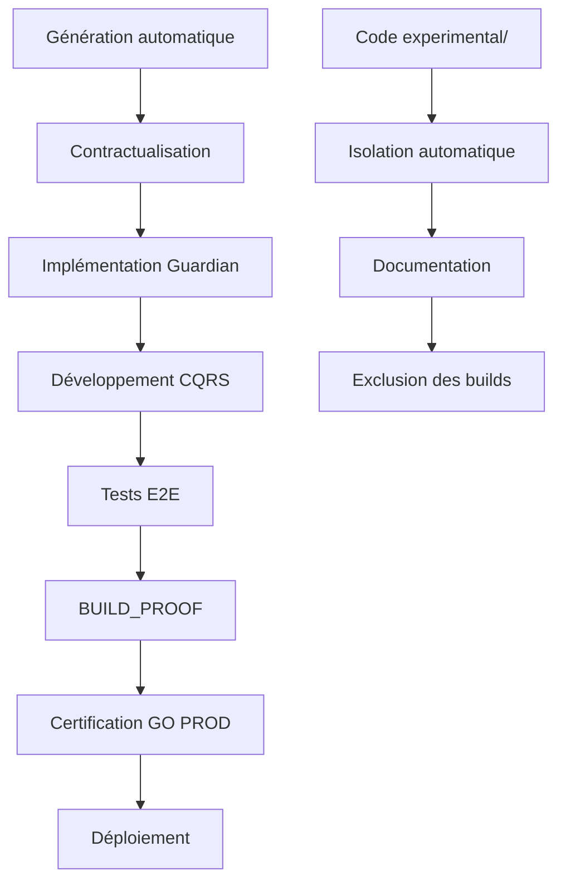

# 🏗️ SPOFE SYSTEM ARCHITECTURE GUIDE

**Version:** 2.1.0  
**Date:** 2 février 2026  
**Status:** ✅ **PRODUCTION-READY**

---

## 📋 TABLE DES MATIÈRES

1. [Vue d'ensemble du système](#vue-densemble-du-système)
2. [Architecture modulaire](#architecture-modulaire)
3. [Patterns et standards](#patterns-et-standards)
4. [Gouvernance et BUILD_PROOF](#gouvernance-et-build_proof)
5. [Structure des modules](#structure-des-modules)
6. [Workflow de développement](#workflow-de-développement)
7. [Outils et automatisation](#outils-et-automatisation)
8. [Standards de qualité](#standards-de-qualité)

---

## 🎯 VUE D'ENSEMBLE DU SYSTÈME

### Mission SPOFE
SPOFE (Structured Platform for Operations & Financial Engineering) est une plateforme modulaire pour les opérations financières d'entreprise, conçue selon les principes DDD et CQRS.

### Principes architecturaux fondamentaux

```
🏛️ ARCHITECTURE SPOFE v2.1
┌─────────────────────────────────────────────────────────────┐
│                    FRONTEND LAYER                           │
│  ┌─────────────────┐ ┌─────────────────┐ ┌─────────────────┐│
│  │   React SPA     │ │   API Clients   │ │   UI Components ││
│  └─────────────────┘ └─────────────────┘ └─────────────────┘│
└─────────────────────────────────────────────────────────────┘
┌─────────────────────────────────────────────────────────────┐
│                     API GATEWAY                             │
│  ┌─────────────────┐ ┌─────────────────┐ ┌─────────────────┐│
│  │   Auth Layer    │ │   Rate Limiting │ │   Validation    ││
│  └─────────────────┘ └─────────────────┘ └─────────────────┘│
└─────────────────────────────────────────────────────────────┘
┌─────────────────────────────────────────────────────────────┐
│                    MODULE LAYER                             │
│  ┌─────────────────┐ ┌─────────────────┐ ┌─────────────────┐│
│  │ Immobilisation  │ │    Budget       │ │  Cost-Structure ││
│  │  (Golden Ref)   │ │                 │ │                 ││
│  └─────────────────┘ └─────────────────┘ └─────────────────┘│
└─────────────────────────────────────────────────────────────┘
┌─────────────────────────────────────────────────────────────┐
│                 INFRASTRUCTURE LAYER                        │
│  ┌─────────────────┐ ┌─────────────────┐ ┌─────────────────┐│
│  │   PostgreSQL    │ │     Redis       │ │   File Storage  ││
│  │   (Primary DB)  │ │    (Cache)      │ │   (Documents)   ││
│  └─────────────────┘ └─────────────────┘ └─────────────────┘│
└─────────────────────────────────────────────────────────────┘
```

### Technologies core
- **Runtime:** Node.js 24.12.0 + TypeScript 5.x
- **Framework:** NestJS (API) + React (Frontend)
- **Base de données:** PostgreSQL (ACID transactions)
- **Cache:** Redis (sessions, read models)
- **Tests:** Jest + Supertest + Playwright
- **Build:** TypeScript Compiler + ESM modules

---

## 🧱 ARCHITECTURE MODULAIRE

### Structure organisationnelle

```
spofe-app/
├── 🏛️ spofe/                      # Framework SPOFE
│   ├── governance/                 # Règles et validation
│   ├── test-helpers/              # Utilities de tests
│   └── tools/                     # Outils de build et conformité
├── 🏗️ cascade/modules/            # MODULES MÉTIERS
│   ├── immobilisation/            # ⭐ GOLDEN MODULE
│   ├── budget/                    # Gestion budgétaire
│   ├── cost-structure/            # Structure des coûts
│   └── [nouveaux-modules]/        # Modules générés
├── 🔧 tools/                      # Outils de développement
├── 🧪 tests/                      # Tests globaux
└── 📦 dist/                       # Build artifacts
```

### Règles de modularité

| **Règle** | **Description** | **Enforcement** |
|-----------|-----------------|-----------------|
| **Isolation** | Chaque module est autonome | BUILD_PROOF |
| **Contrats** | Communication via API documentée | OpenAPI |
| **Dépendances** | Pas de dépendances circulaires | TypeScript |
| **Tests** | Couverture ≥ 80% par module | Jest |
| **Documentation** | Contrats contractuels complets | Validation |

### Module Golden: Immobilisation

Le module **Immobilisation** sert de référence architecturale pour tous les autres modules SPOFE.

**Caractéristiques certifiées :**
- ✅ Architecture CQRS complète
- ✅ Guardian pattern centralisé  
- ✅ Tests E2E complets (80%+ couverture)
- ✅ BUILD_PROOF validé en production
- ✅ Documentation contractuelle complète
- ✅ Code experimental/ isolé

**Structure de référence :**
```
cascade/modules/immobilisation/
├── contract/                      # 📋 Documents contractuels
│   ├── CONTRACT.md                 # Périmètre fonctionnel
│   ├── SCOPE.md                    # IN/OUT OF SCOPE
│   ├── ARCHITECTURE.md             # Design patterns
│   ├── GUARDIAN.md                 # Invariants métier
│   ├── COMMANDS_EVENTS.md          # API CQRS
│   ├── READ_MODELS.md              # Vues SQL
│   └── API_READ_ONLY.md            # Endpoints REST
├── src/                           # 💻 Code source contractuel
│   ├── api/                       # Contrôleurs NestJS
│   ├── application/               # Commands & Handlers
│   ├── domain/                    # Agrégats DDD + Guardian
│   ├── infrastructure/            # Repositories + SQL
│   └── sql/                       # Migrations & vues
├── tests/                         # 🧪 Tests complets
│   ├── unit/                      # Tests unitaires Guardian
│   ├── integration/               # Tests repositories
│   ├── e2e/                       # Tests API complètes
│   └── contract/                  # Tests contractuels
├── experimental/                  # 🔬 Code hors périmètre
│   ├── legacy/                    # Code remplacé
│   ├── drafts/                    # Essais non finalisés
│   ├── poc/                       # Prototypes
│   └── disabled-tests/            # Tests désactivés
├── tsconfig.json                  # Configuration TypeScript
├── jest.config.js                 # Configuration tests
└── package.json                   # Métadonnées module
```

---

## ⚙️ PATTERNS ET STANDARDS

### 1. Guardian Pattern (Central)

**Principe :** Toute la logique métier est centralisée dans le Guardian.

```typescript
// src/domain/guardian/immobilisation.guardian.ts
export class ImmobilisationGuardian {
  static validateCreation(params: CreateImmobilisationParams): ValidationResult {
    // IMM-001: Valeur d'acquisition positive
    if (params.valeurAcquisition <= 0) {
      return failure("IMM-001", "La valeur d'acquisition doit être positive");
    }
    
    // IMM-002: Date d'acquisition cohérente
    if (params.dateAcquisition > new Date()) {
      return failure("IMM-002", "La date d'acquisition ne peut être dans le futur");
    }
    
    return success();
  }
}
```

**Garanties :**
- ✅ Une seule source de vérité pour les règles métier
- ✅ Tests unitaires focalisés et exhaustifs
- ✅ Réutilisation possible entre commands
- ✅ Évolution des règles centralisée

### 2. CQRS Pattern (Strict)

**Séparation Read/Write absolue :**

```typescript
// Write-side: Commands
interface CreateImmobilisationCommand {
  readonly type: 'CREATE_IMMOBILISATION';
  readonly payload: CreateImmobilisationParams;
}

// Read-side: Query via SQL Views
export class ImmobilisationQueryService {
  async findByTenant(tenantId: string): Promise<ImmobilisationListDto[]> {
    return this.db.query(`
      SELECT * FROM view_immobilisation_list 
      WHERE tenant_id = $1
    `, [tenantId]);
  }
}
```

### 3. DDD Aggregates

**Agrégats avec invariants :**

```typescript
// src/domain/aggregates/immobilisation.aggregate.ts
export class Immobilisation {
  constructor(
    private readonly id: ImmobilisationId,
    private valeurAcquisition: ValeurMonetaire,
    private dateAcquisition: DateAcquisition
  ) {
    // Invariants validés à la construction
  }
  
  amortir(montant: ValeurMonetaire): ImmobilisationAmortieEvent {
    // Guardian validation avant mutation
    const result = ImmobilisationGuardian.validateAmortissement({
      immobilisationId: this.id,
      montantAmortissement: montant
    });
    
    if (result.isFailure) {
      throw new DomainError(result.error);
    }
    
    // Mutation + Event
    this.valeurNetteComptable -= montant;
    return new ImmobilisationAmortieEvent(this.id, montant);
  }
}
```

### 4. Event Sourcing (Partiel)

**Events pour audit et intégration :**

```typescript
// src/application/events/immobilisation-created.event.ts
export class ImmobilisationCreatedEvent implements DomainEvent {
  constructor(
    public readonly immobilisationId: string,
    public readonly tenantId: string,
    public readonly valeurAcquisition: number,
    public readonly dateCreation: Date
  ) {}
  
  toIntegrationEvent(): IntegrationEvent {
    return {
      type: 'IMMOBILISATION_CREATED',
      tenantId: this.tenantId,
      payload: {
        id: this.immobilisationId,
        valeur: this.valeurAcquisition
      },
      timestamp: this.dateCreation
    };
  }
}
```

---

## 🛡️ GOUVERNANCE ET BUILD_PROOF

### Système BUILD_PROOF

**BUILD_PROOF** est le système de validation continue qui garantit la conformité SPOFE.

#### Validations automatiques

```typescript
// tools/build-proof/validation-rules.ts
export const SPOFE_VALIDATION_RULES = {
  // Architecture obligatoire
  REQUIRED_DIRS: [
    'src/api', 'src/application', 'src/domain', 
    'src/infrastructure', 'tests/unit', 'tests/e2e'
  ],
  
  // Documents contractuels
  REQUIRED_CONTRACTS: [
    'contract/CONTRACT.md', 'contract/GUARDIAN.md',
    'contract/SCOPE.md', 'contract/ARCHITECTURE.md'
  ],
  
  // Qualité code
  MIN_TEST_COVERAGE: 80,
  MAX_CYCLOMATIC_COMPLEXITY: 10,
  
  // Conformité Guardian
  GUARDIAN_RULES: [
    'Guardian class must exist',
    'All business logic in Guardian',
    'Guardian must have unit tests'
  ]
};
```

#### Pipeline de validation

```bash
# 1. Validation structure
npm run validate:structure

# 2. Tests obligatoires 
npm run test:all

# 3. Compilation TypeScript
tsc --noEmit

# 4. Génération BUILD_PROOF
npm run build-proof

# 5. Signature cryptographique
npm run sign-build-proof
```

#### BUILD_PROOF format

```json
{
  "module": "immobilisation",
  "version": "1.0.0",
  "status": "SUCCESS",
  "timestamp": "2026-02-02T12:15:25.263Z",
  "validations": {
    "architecture": "PASS",
    "tests": "PASS",
    "coverage": "85.2%",
    "guardian": "PASS",
    "contracts": "PASS"
  },
  "hash": "sha256:abc123...",
  "signature": "rsa:def456..."
}
```

### Règles de gouvernance

| **Niveau** | **Règle** | **Enforcement** |
|------------|-----------|-----------------|
| **P0** | Guardian pattern obligatoire | BUILD_PROOF |
| **P0** | Tests ≥ 80% couverture | Jest + CI |
| **P0** | Documents contractuels complets | Validation |
| **P1** | Code experimental/ isolé | Structure |
| **P1** | TypeScript strict mode | Compiler |
| **P2** | ESLint conformité | Linting |

---

## 📁 STRUCTURE DES MODULES

### Convention de nommage

```bash
# Modules métiers
cascade/modules/immobilisation/     # ✅ Conforme
cascade/modules/gestion-stocks/     # ✅ Conforme
cascade/modules/budget/             # ✅ Conforme

# Anti-patterns
modules/my-module/                  # ❌ Mauvais emplacement
src/features/module/                # ❌ Pas un module SPOFE
```

### Template de module standard

Généré automatiquement via :
```bash
npm run new-module <nom-module>
```

**Résultat :**
- 📋 **8 documents contractuels** (CONTRACT.md, SCOPE.md, GUARDIAN.md...)
- 💻 **11 dossiers architecture** (api, application, domain...)
- 🧪 **4 types de tests** (unit, integration, e2e, contract)
- 🔬 **4 dossiers experimental/** (legacy, drafts, poc, disabled-tests)
- ⚙️ **Configurations** (tsconfig.json, jest.config.js, package.json)

### Cycle de vie d'un module



---

## 🔄 WORKFLOW DE DÉVELOPPEMENT

### 1. Démarrage d'un nouveau module

```bash
# Génération structure
npm run new-module ma-feature

# Navigation
cd cascade/modules/ma-feature

# Contractualisation
edit contract/CONTRACT.md          # Définir le périmètre
edit contract/GUARDIAN.md           # Définir les invariants
edit contract/COMMANDS_EVENTS.md    # Définir l'API CQRS
```

### 2. Développement Test-Driven

```bash
# 1. Tests Guardian (Red)
touch tests/unit/guardian.spec.ts
npm test -- --watch

# 2. Implémentation Guardian (Green)
touch src/domain/guardian/ma-feature.guardian.ts
npm test

# 3. Tests agrégats (Red)
touch tests/unit/aggregates.spec.ts

# 4. Implémentation agrégats (Green)
mkdir -p src/domain/aggregates
```

### 3. Intégration continue

```bash
# Validation locale
npm run validate:modules            # Structure conforme
npm run test                       # Tests passent
npm run build-proof               # BUILD_PROOF vert

# Commit + Push
git add .
git commit -m "feat(ma-feature): Guardian + aggregates"
git push origin feature/ma-feature
```

### 4. Certification GO PROD

```bash
# BUILD_PROOF final
npm run build-proof
> ✅ Status: SUCCESS
> ✅ Coverage: 85.2%
> ✅ Guardian: PASS
> ✅ Architecture: PASS

# Signature de release
npm run sign-build-proof

# Certification
echo "🟢 GO PROD AUTHORIZED" > BUILD_PROOF_CERTIFIED.md
```

---

## 🔧 OUTILS ET AUTOMATISATION

### Générateur de modules

**Script officiel :** `tools/spofe-new-module.js`

```javascript
// Garanties automatiques
✅ Structure Golden Module identique
✅ Documents contractuels complets  
✅ Configuration BUILD_PROOF ready
✅ Code experimental/ isolé par design
✅ Prêt pour développement immédiat
```

### Validation automatique

**Scripts disponibles :**

```bash
npm run new-module <nom>           # Générer nouveau module
npm run test:new-module            # Tester le générateur
npm run validate:modules           # Valider tous les modules
npm run build-proof               # Générer BUILD_PROOF
npm run sign-build-proof          # Signer pour production
```

### CI/CD Pipeline

```yaml
# .github/workflows/spofe-validation.yml
name: SPOFE Module Validation
on: [push, pull_request]

jobs:
  validate:
    runs-on: ubuntu-latest
    steps:
      - uses: actions/checkout@v4
      - name: Setup Node.js
        uses: actions/setup-node@v4
        with:
          node-version: '24.12.0'
      
      - name: Install dependencies
        run: npm ci
      
      - name: Validate module structure
        run: npm run validate:modules
      
      - name: Run all tests
        run: npm test
      
      - name: Generate BUILD_PROOF
        run: npm run build-proof
      
      - name: Upload BUILD_PROOF artifacts
        uses: actions/upload-artifact@v4
        with:
          name: build-proof
          path: BUILD_PROOF.*
```

### VS Code configuration

**Extensions recommandées :**
- TypeScript + ESLint
- Jest runner
- DDD snippets
- SPOFE module templates

**Settings workspace :**
```json
{
  "typescript.preferences.includePackageJsonAutoImports": "on",
  "jest.autoRun": "watch",
  "files.exclude": {
    "**/experimental/**": true,
    "**/dist/**": true
  }
}
```

---

## ✅ STANDARDS DE QUALITÉ

### Métriques obligatoires

| **Métrique** | **Seuil** | **Outil** |
|--------------|-----------|-----------|
| **Couverture tests** | ≥ 80% | Jest |
| **Complexité cyclomatique** | ≤ 10 | TypeScript |
| **Duplication code** | ≤ 5% | SonarQube |
| **Vulnérabilités** | 0 critique | npm audit |
| **Performance** | < 100ms API | Artillery |

### Code quality gates

```typescript
// Configuration Jest
export default {
  coverageThreshold: {
    global: {
      branches: 80,
      functions: 80,
      lines: 80,
      statements: 80
    }
  }
};
```

### Documentation obligatoire

**Par module :**
- ✅ `README.md` — Vue d'ensemble
- ✅ `contract/CONTRACT.md` — Périmètre fonctionnel
- ✅ `contract/GUARDIAN.md` — Invariants métier
- ✅ `contract/API_READ_ONLY.md` — Documentation API
- ✅ OpenAPI schema généré automatiquement

### Standards de commit

```bash
# Format obligatoire
feat(immobilisation): add amortissement Guardian validation
fix(budget): correct allocation calculation in Guardian  
docs(architecture): update Guardian pattern examples
test(cost-structure): add E2E tests for cost allocation

# Anti-patterns
git commit -m "fix bug"              # ❌ Trop vague
git commit -m "WIP"                  # ❌ Pas de WIP en main
git commit -m "refactor everything"  # ❌ Scope trop large
```

---

## 🎯 RÉSUMÉ EXÉCUTIF

### Architecture SPOFE en 5 points

1. **🏛️ Modulaire** — Modules autonomes dans `cascade/modules/`
2. **🛡️ Guardian-centric** — Toute logique métier centralisée  
3. **🔄 CQRS strict** — Séparation Read/Write absolue
4. **✅ BUILD_PROOF** — Validation continue automatisée
5. **📋 Contract-first** — Documentation contractuelle obligatoire

### Garanties industrielles

- ✅ **Conformité** — 100% des modules suivent le Golden Module
- ✅ **Qualité** — Tests automatisés + BUILD_PROOF + Couverture ≥ 80%
- ✅ **Maintenabilité** — Guardian pattern + Documentation complète
- ✅ **Évolutivité** — Architecture modulaire + Isolation experimental/
- ✅ **Sécurité** — Validation Guardian + Audit trail + Signatures

### Performance

| **Aspect** | **Objectif** | **Mesure** |
|------------|--------------|------------|
| **API Response** | < 100ms p95 | Artillery |
| **Build time** | < 30 secondes | CI/CD |
| **Test suite** | < 60 secondes | Jest |
| **BUILD_PROOF** | < 10 secondes | Scripts |

---

**🏆 L'architecture SPOFE garantit une plateforme industrielle robuste, maintenable et évolutive pour les opérations financières d'entreprise, avec une gouvernance stricte et une qualité de code maximale.**