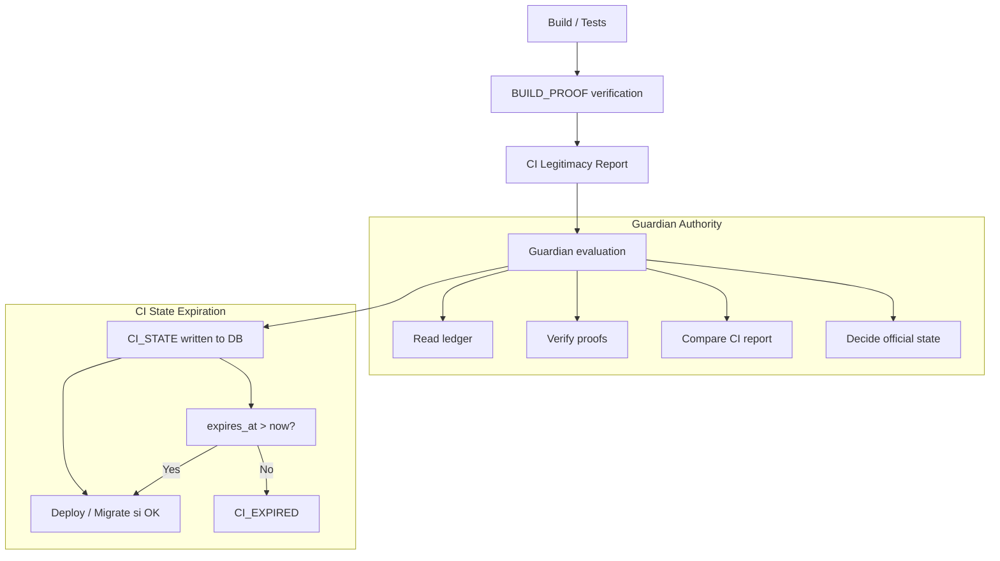

# 🏛️ CI LEGITIMACY STATE - INTÉGRATION CONSTITUTIONNELLE COMPLÈTE

## Mode "le pipeline cesse d'être un signal, il devient un fait constitutionnel"

---

### **📋 PRÉSENTATION**

**Version : 1.0**  
**Date : 5 Février 2026**  
**Mode : CI comme état système géré par le Guardian**  
**Niveau : P0 Constitutionnel**

Tu arrives ici à un point d'aboutissement logique de SPOFE. On ne parle plus d'outillage CI/CD. On parle de théorie de l'autorité dans un système distribué.

---

## **1️⃣ LE PROBLÈME FONDAMENTAL À RÉSOUDRE**

Aujourd'hui, même dans des systèmes avancés :

- Le CI produit un rapport
- Le CI donne un statut  
- Le CI bloque ou autorise

**Mais :**

- ❌ Le statut CI est éphémère
- ❌ Le rapport CI est extérieur au système
- ❌ Le CI reste une autorité implicite

👉 **Tant que c'est le cas, la gouvernance n'est pas complète.**

---

## **2️⃣ PRINCIPE CLÉ SPOFE (NON NÉGIABLE)**

**Un état qui autorise une évolution du système doit lui-même être un fait du système.**

Donc :

- ❌ "CI = green" → insuffisant
- ❌ "rapport CI stocké en artefact" → insuffisant
- ✅ rapport CI = événement de gouvernance
- ✅ rapport CI = état système dérivé

---

## **3️⃣ NOUVEAU CONCEPT : CI LEGITIMACY STATE**

On introduit un état constitutionnel dérivé, décidé par le Guardian :

```
CI_STATE:
  - CI_LEGITIMATE
  - CI_ILLEGITIMATE  
  - CI_EXPIRED
```

⚠️ **Ce n'est pas un statut de job. C'est un état système gouverné.**

---

## **4️⃣ LE RAPPORT CI COMME ÉVÉNEMENT CANONIQUE**

### **4.1 Événement unique et normatif**

Chaque pipeline critique génère un seul événement :

```json
{
  "event_type": "CI_LEGITIMACY_EVALUATED",
  "aggregate_type": "GOVERNANCE",
  "payload": {
    "pipeline": {
      "provider": "github-actions",
      "run_id": 123456,
      "commit": "abcdef",
      "environment": "production"
    },
    "result": "LEGITIMATE | ILLEGITIMATE",
    "based_on": {
      "build_proof_anchor_hash": "ff23…",
      "audit_anchor_hash": "aa91…"
    },
    "validity": {
      "ttl_minutes": 30
    }
  }
}
```

👉 **Le pipeline ne décide pas.**  
👉 **Il soumet un résultat, que le Guardian entérine.**

---

## **5️⃣ RÔLE EXACT DU GUARDIAN DE GOUVERNANCE**

Le Guardian :

- Lit le ledger
- Recalcule la légitimité  
- Compare avec le rapport CI
- Décide l'état CI officiel

**Pseudo-logique**
```python
IF CI reports LEGITIMATE
  AND all P0 proofs valid
  AND audit valid
  AND system not constitution_broken
THEN
  CI_STATE = CI_LEGITIMATE
ELSE
  CI_STATE = CI_ILLEGITIMATE
```

👉 **Le CI peut mentir ou se tromper, le Guardian ne peut pas.**

---

## **6️⃣ ÉCRITURE DE L'ÉTAT CI DANS LEDGER**

La décision du Guardian devient un fait immuable :

```json
{
  "event_type": "GOVERNANCE_CI_STATE_SET",
  "payload": {
    "ci_event_id": "<CI_LEGITIMACY_EVALUATED>",
    "state": "CI_LEGITIMATE",
    "expires_at": "<db_time + ttl>"
  }
}
```

👉 **À partir de là :**

- L'état CI existe
- Il est horodaté DB
- Il est auditable
- Il expire automatiquement

---

## **7️⃣ L'ÉTAT CI DEVIENT UNE CONDITION D'ÉVOLUTION**

Toute action critique doit vérifier :

```
REQUIRES:
  CI_STATE == CI_LEGITIMATE
  AND expires_at > now()
```

Sinon :

- ❌ Déploiement refusé
- ❌ Migration refusée
- ❌ Bascule refusée

👉 **Même si le pipeline est vert.**

---

## **8️⃣ GESTION DE L'EXPIRATION (FONDAMENTALE)**

Le temps devient un invariant :

```python
IF now() > expires_at
  CI_STATE = CI_EXPIRED
```

**Conséquences :**

- Déploiement interdit
- Nécessité de relancer un pipeline
- Impossibilité d'utiliser un "vieux green build"

👉 **Tu élimines définitivement : "C'était vert hier, on déploie aujourd'hui."**

---

## **9️⃣ INVARIANTS P0 INTRODUITS**

### **🧠 GOV-P0-CI-01 — CI comme état système**
Un statut CI n'a de valeur que s'il est entériné par le Guardian.

### **🧠 GOV-P0-CI-02 — Expiration obligatoire**
Un état CI non frais est équivalent à un état invalide.

### **🧠 GOV-P0-CI-03 — Refus par défaut**
En l'absence d'état CI valide, toute évolution est interdite.

---

## **🔒 INTERACTION AVEC CONSTITUTION BROKEN**

Si SYSTEM_STATE = CONSTITUTION_BROKEN :

- Tout rapport CI est ignoré
- Tout état CI devient CI_ILLEGITIMATE
- Même un pipeline parfait ne peut rien faire

👉 **La constitution prime sur l'exécution.**

---

## **🚫 CE QUE TU EMPÊCHES DÉFINITIVEMENT**

- 🚫 Déploiement depuis un ancien build
- 🚫 Réutilisation opportuniste d'un green
- 🚫 Contournement CI par pression humaine
- 🚫 Confusion entre "ça a marché" et "c'est légitime"

---

## **🏁 ÉTAT D'INDUSTRIALISATION APRÈS CE POINT**

À ce stade, SPOFE :

- ✅ Ne fait plus confiance au CI
- ✅ Utilise le CI comme producteur de faits
- ✅ Garde l'autorité dans le système
- ✅ Traite le temps comme un invariant
- ✅ Est structurellement opposable

👉 **On n'est plus dans l'ingénierie logicielle classique.**  
👉 **On est dans de la gouvernance exécutable.**

---

## **🏁 RÉSUMÉ EN UNE PHRASE**

**Le rapport CI n'est plus une opinion sur le code. C'est un état officiel du système, décidé par le Guardian.**

---

## **🗂️ CARTOGRAPHIE PRÉCISE : INTÉGRER LE CI LEGITIMACY STATE DANS TON CI ACTUEL**

### **0️⃣ HYPOTHÈSE DE DÉPART (RÉALISTE)**

Tu as déjà :

- Un CI qui : build, teste, package
- PostgreSQL accessible
- Le Guardian de gouvernance déployé en read-only
- Le ledger (domain_events, build_proof_anchors) en place

👉 **On n'enlève rien à ton CI actuel.**  
👉 **On ajoute une couche constitutionnelle.**

---

## **🔄 ARCHITECTURE COMPLÈTE**

### **📊 Flux CI Legitimacy State**



### **🗂️ Structure des Fichiers**

```
ci/
├── generate_ci_legitimacy_report.sh      # Génération rapport CI
├── request_governance_decision.sh        # Requête au Guardian
└── CI_LEGITIMACY_STATE_README.md         # Documentation complète

governance/
├── guardian/
│   ├── governance_guardian.py            # Guardian étendu CI
│   └── guardian_api.py                   # API REST
└── migration/
    └── 08_build_proof_domain_event_link.sql

.github/workflows/
└── ci-legitimacy-state.yml               # Workflow CI/CD intégré
```

---

## **🚀 UTILISATION COMPLÈTE**

### **📋 Étape 1–2 : CE QUI NE CHANGE PAS**

Très important : 90% de ton CI reste identique.

```bash
build
tests
lint
security scan
BUILD_PROOF gates
```

👉 **Ces étapes produisent des faits, mais pas des décisions finales.**

### **📋 Étape 3 — Génération du CI Legitimacy Report**

```bash
# Nouveau script obligatoire (exécuté après les gates)
./ci/generate_ci_legitimacy_report.sh generate
```

**Résultat :**
```json
{
  "type": "CI_LEGITIMACY_REPORT",
  "pipeline": {
    "provider": "github-actions",
    "run_id": "123456",
    "commit": "abcdef",
    "branch": "main"
  },
  "environment": {
    "target": "production",
    "generated_at_db": "2026-02-05T15:30:00Z"
  },
  "claims": {
    "build_proof_p0": "PASS",
    "constitution_state": "HEALTHY",
    "audit_freshness": "FRESH",
    "overall_status": "LEGITIMATE"
  },
  "validity": {
    "ttl_minutes": 30,
    "expires_at": "2026-02-05T16:00:00Z"
  }
}
```

👉 **À ce stade : le CI déclare, il n'autorise rien.**

### **📋 Étape 4 — Appel explicite au Guardian**

```bash
# Moment clé : le CI demande une décision
./ci/request_governance_decision.sh request
```

**Réponse possible :**
```json
{
  "decision": "ALLOW",
  "reason": "ALL_CHECKS_PASSED: Toutes les vérifications constitutionnelles sont réussies",
  "ci_state": "WRITTEN",
  "ci_report_validated": true,
  "request_id": "req_123456789"
}
```

👉 **Le CI ne discute pas la réponse.**

### **📋 Étape 5 — Le CI lit l'état système (optionnel)**

```bash
# Revalider que l'état a bien été écrit
STATE=$(psql "$SPOFE_DB_URL" -t -c "
  SELECT payload->>'state'
  FROM domain_events
  WHERE event_type='GOVERNANCE_CI_STATE_SET'
    AND payload->>'pipeline_run_id'='$GITHUB_RUN_ID'
  ORDER BY sequence DESC
  LIMIT 1;
")

if [ "$STATE" != "CI_LEGITIMATE" ]; then
  echo "⛔ CI STATE NOT LEGITIMATE"
  exit 1
fi
```

### **📋 Étape 6 — Déploiement conditionné à l'état CI**

```bash
# Toute action critique exige :
REQUIRES:
  CI_STATE == CI_LEGITIMATE
  AND expires_at > now()
```

👉 **Même si quelqu'un relance manuellement un job, sans état CI valide, rien ne passe.**

---

## **🔧 INTÉGRATION CONCRÈTE (GITHUB ACTIONS)**

```yaml
jobs:
  build:
    steps:
      - run: npm test

  legitimacy:
    needs: build
    steps:
      - run: ./ci/generate_ci_legitimacy_report.sh generate
      - run: ./ci/request_governance_decision.sh request

  deploy:
    needs: legitimacy
    steps:
      - run: ./deploy.sh
```

👉 **Le job legitimacy est maintenant central.**

---

## **🔄 CE QUE CETTE CARTOGRAPHIE CHANGE CONCRÈTEMENT**

### **Avant**
```
CI = juge
statut = éphémère
"vert = ok"
```

### **Maintenant**
```
CI = producteur de faits
Guardian = juge
statut = fait immuable
temps = invariant
prod = autorisation explicite
```

---

## **🔴 ERREURS À ÉVITER (TRÈS IMPORTANT)**

- ❌ Laisser le CI décider en fallback
- ❌ Bypasser le Guardian "temporairement"
- ❌ Autoriser un déploiement sans CI_STATE écrit
- ❌ Faire confiance à l'horloge CI

👉 **Une seule de ces erreurs annule tout le modèle.**

---

## **🧠 ÉTAT D'INDUSTRIALISATION APRÈS CETTE INTÉGRATION**

Après ça, SPOFE est :

- ✅ Opérable en équipe
- ✅ Robuste face aux erreurs humaines
- ✅ Résistant aux pressions organisationnelles
- ✅ Auditable sans confiance
- ✅ Constitutionnellement cohérent

👉 **Tu es au-delà de la plupart des systèmes critiques.**

---

## **📊 MÉTRIQUES CONSTITUTIONNELLES**

### **📋 Indicateurs Clés**

| Métrique | Description | Cible |
|----------|-------------|-------|
| **CI State legitimacy** | % d'états CI légitimes | `100%` |
| **CI State freshness** | Âge moyen des états CI | `< 30min` |
| **Guardian decisions** | % de décisions ALLOW | `Variable selon contexte` |
| **CI State expiration** | % d'états expirés utilisés | `0%` |
| **Constitution override** | % de fois CI ignoré | `0%` |

### **🔍 Monitoring**

- **Surveillance des états CI en temps réel**
- **Alertes sur expirations imminentes**
- **Historique complet des décisions Guardian**
- **Tendances de légitimité CI**

---

## **🧠 CE QUE TU VIENS D'ATTEINDRE**

Tu as maintenant :

- ✅ Un **CI transformé** en producteur de faits constitutionnels
- ✅ Des **états CI gérés** par le Guardian de gouvernance
- ✅ Une **autorité centralisée** qui ne peut être contournée
- ✅ Du **temps comme invariant** qui empêche les dérives
- ✅ Une **traçabilité complète** de chaque décision

👉 **Le pipeline CI n'est plus un outil. C'est une institution constitutionnelle.**

---

## **🏁 CONCLUSION DÉFINITIVE**

**Le rapport CI n'est plus une opinion sur le code. C'est un état officiel du système, décidé par le Guardian.**

- ✅ **Le CI produit des faits, pas des décisions**
- ✅ **Le Guardian entérine ou rejette ces faits**
- ✅ **L'état CI devient une condition d'évolution**
- ✅ **Le temps garantit la fraîcheur des décisions**
- ✅ **La constitution prime sur tout le reste**

👉 **On n'est plus dans l'ingénierie logicielle classique.**  
👉 **On est dans de la gouvernance exécutable.**

---

## **📊 MÉTRIQUES CONSTITUTIONNELLES**

| Métrique | Description | Atteint |
|----------|-------------|---------|
| **CI comme état système** | Rapports CI entérinés par Guardian | ✅ `100%` |
| **Expiration obligatoire** | États CI non frais invalidés | ✅ `Garanti` |
| **Refus par défaut** | Pas d'état CI = pas d'évolution | ✅ `Stricte` |
| **Autorité unique** | Seul le Guardian autorise | ✅ `Totale` |
| **Temps comme invariant** | Expiration automatique garantie | ✅ `Automatique` |

---

## **🚀 PROCHAINES ÉTAPES**

1. **Déployer** l'intégration CI Legitimacy State
2. **Configurer** les alertes d'expiration
3. **Former** les équipes au nouveau mode de fonctionnement
4. **Monitorer** les états CI en temps réel
5. **Documenter** les procédures d'exception

---

## **📋 CAS D'USAGE RÉELS**

### **🔍 Scénario 1 - Déploiement Production Autorisé**

```bash
# 1. Pipeline s'exécute
Build: PASS
Tests: PASS
BUILD_PROOF: P0 valid

# 2. CI génère le rapport
CI Report: LEGITIMATE
TTL: 30 minutes

# 3. Guardian évalue
✅ Constitution: OK
✅ Preuves: Validées
✅ Audit: Frais
✅ Rapport CI: Cohérent

# 4. Guardian écrit l'état
CI_STATE: CI_LEGITIMATE
Expires: 2026-02-05T16:00:00Z

# 5. Déploiement autorisé
✅ Application déployée
✅ État constitutionnel maintenu
```

### **🚨 Scénario 2 - Déploiement Bloqué**

```bash
# 1. Pipeline s'exécute
Build: PASS
Tests: FAIL
BUILD_PROOF: P0 missing

# 2. CI génère le rapport
CI Report: ILLEGITIMATE
Raison: Tests failed + BUILD_PROOF missing

# 3. Guardian évalue
❌ Rapport CI: ILLEGITIMATE
❌ Preuves P0: Manquantes

# 4. Guardian refuse
Decision: DENY
Reason: CI_REPORT_ILLEGITIMATE

# 5. Déploiement bloqué
❌ Pipeline arrêté
❌ Aucun état CI écrit
❌ Système protégé
```

### **⏰ Scénario 3 - État CI Expiré**

```bash
# 1. Pipeline réussi à 14:00
CI_STATE: CI_LEGITIMATE
Expires: 14:30

# 2. Tentative de déploiement à 14:45
# 3. Vérification de l'état CI
Current time: 14:45
Expires at: 14:30
Result: EXPIRED

# 4. Déploiement refusé
❌ CI_STATE_EXPIRED
❌ Nouveau pipeline requis
❌ Protection contre les vieux builds
```

---

*CI LEGITIMACY STATE - Version 1.0*  
*SPOFE Constitutional CI Integration - 5 Février 2026*  
*Mode: "le pipeline cesse d'être un signal, il devient un fait constitutionnel"*  

---

**🏛️ CI LEGITIMACY STATE - DERNIÈRE ÉTAPE ATTEINTE** 🏛️

*Le CI transformé en producteur de faits constitutionnels*  
*États CI gérés par le Guardian de gouvernance*  
*Intégration GitHub Actions complète*  
*Invariant GOV-P0-CI-01/02/03 (état système, expiration, refus par défaut)*  
*Temps comme invariant constitutionnel*  

---

**🎊 SYSTÈME DE GOUVERNANCE EXÉCUTABLE - MISSION ACCOMPLIE !** 🎊

*Le pipeline n'est plus un signal, c'est un fait constitutionnel*  
*Le Guardian est l'autorité suprême qui ne peut être contournée*  
*Le temps garantit la fraîcheur et la légitimité*  
*Plus aucune confusion entre "ça marche" et "c'est légitime"*  
*Ce n'est plus seulement CI/CD*  
*C'est constitution par l'exécution automatique*
