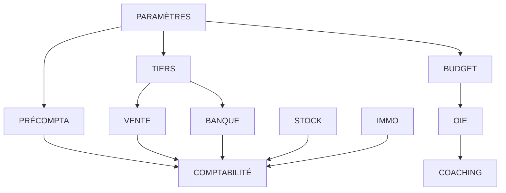

# 🎯 PLAN D'ACTION CERTIFICATION COMPLÈTE SPOFE - VERSION OPTIMISÉE

**Date : 4 Février 2026**  
**Système : SPOFE v2.1.0**  
**Objectif : 78% → 100% BUILD_PROOF**  
**Approche : Intelligente, cohérente, alignée gouvernance, progressiste**

---

## 📋 CONTEXTE STRATÉGIQUE

### **🎯 Compréhension Correcte du 78%**

**Ce que 78% signifie VRAIMENT :**
- ✅ **Architecture quasi parfaite** (hexagonale, CQRS, TransactionManager)
- ✅ **Gouvernance solide** (Guardian obligatoire, barrière transactionnelle)
- ✅ **Outils BUILD_PROOF prêts** (scripts, AGA, signature)
- 🔄 **Modules métier incomplets contractuellement**

**Ce que 78% ne signifie PAS :**
- ❌ Système bancal ou fragile
- ❌ Architecture à refondre
- ❌ Base technique compromise

**👉 Situation excellente : socle prêt, finition modulaire nécessaire**

---

## ⚠️ NUANCE CRITIQUE : POLLUTION BUILD_PROOF

### **Problème Identifié**
**❌ Pollution par BUILD_PROOF déclaratifs non adossés à preuve complète**

**Conséquences :**
- Modules "marqués certifiés" trop tôt
- Sans contracts complets
- Sans Guardian P0 vérifié
- Sans tests constitutionnels

### **🧹 PHASE 0 - ASSAINISSEMENT (OBLIGATOIRE)**

**Objectif : Revenir à une vérité BUILD_PROOF propre**

**Actions immédiates :**
- [ ] **Auditer tous les BUILD_PROOF.json existants**
- [ ] **Supprimer les certifications non adossées à preuve**
- [ ] **Ne conserver que les modules réellement certifiés** :
  - ✅ Comptabilité Générale (référence)
  - ✅ Modules avec Guardian + tests + contracts complets
- [ ] **Recalculer score global** (restera ~78%)
- [ ] **Documenter l'état réel** dans un rapport d'assainissement

**👉 Sans cette phase, toute certification ultérieure est invalide**

---

## 🏗️ ORDRE OFFICIEL DE CERTIFICATION

### **Règle d'Or**
**👉 On certifie du plus dépendant au plus dépendu**
**👉 On commence par ce qui bloque les autres**

### **📊 Ordre Optimisé des Modules**

| Ordre | Module | Priorité | Pourquoi ? | Durée estimée |
|-------|--------|----------|------------|---------------|
| 1️⃣ | **PARAMÈTRES** | ABSOLUE | Socle normatif transverse | 3-4 jours |
| 2️⃣ | **GESTION DES TIERS** | MAXIMALE | Vérité identitaire comptable | 4-5 jours |
| 3️⃣ | **PRÉCOMPTABILITÉ** | ÉLEVÉE | Douane documentaire | 3-4 jours |
| 4️⃣ | **OIE** | MOYENNE | Pilotage stratégique | 3-4 jours |
| 5️⃣ | **BUDGET** | MOYENNE | Prévisionnel distinct | 2-3 jours |
| 6️⃣ | **BANQUE + CAISSE** | MOYENNE | Flux monétaires | 3-4 jours |
| 7️⃣ | **VENTE** | FAIBLE | Fait commercial | 4-5 jours |
| 8️⃣ | **STOCK & IMMOBILISATION** | FAIBLE | Nettoyage final | 2-3 jours |

---

## 🎯 DÉTAIL DES PHASES DE CERTIFICATION

### **🥇 1️⃣ MODULE PARAMÈTRES (PRIORITÉ ABSOLUE)**

**🎯 Objectif**
Certifier le socle normatif transverse :
- États & statuts
- Périodes  
- Plans comptables
- Catalogue des documents

**🔍 Pourquoi en premier**
- Tous les modules dépendent implicitement de Paramètres
- Toute certification sans Paramètres certifié est fragile
- C'est le verrou sémantique global

**🧱 Livrables**
- [ ] **SCOPE.md final** (déjà bien avancé)
- [ ] **GUARDIAN.md** (invariants normatifs)
- [ ] **Tests Guardian P0**
- [ ] **Read-models**
- [ ] **BUILD_PROOF Paramètres**

**⏡ Timeline : 3-4 jours**

---

### **🏢 2️⃣ GESTION DES TIERS (CLASSE 4)**

**🎯 Objectif**
Certifier la vérité identitaire comptable :
- Clients
- Fournisseurs  
- Autres tiers

**🔍 Pourquoi maintenant**
- Comptabilité s'appuie dessus
- Vente / Précompta / Banque / Caisse en dépendent
- Sans lui, la classe 4 est implicite → interdit SPOFE

**🧱 Livrables**
- [ ] **SCOPE.md clair** (pas un CRM)
- [ ] **Guardian** (création / désactivation / typologie)
- [ ] **Tests P0**
- [ ] **Read-only API**
- [ ] **BUILD_PROOF**

**⏡ Timeline : 4-5 jours**

---

### **📋 3️⃣ PRÉCOMPTABILITÉ**

**🎯 Objectif**
Certifier la douane documentaire :
- Capture
- Qualification  
- Validation

**🔍 Pourquoi ici**
- Déjà bien avancé, mais pas verrouillé
- Alimentateur direct de la Comptabilité
- Pivot entre opérationnel et légal
- Sans Guardian strict → risque majeur

**🧱 Livrables**
- [ ] **Guardian P0** (qualifié / rejeté / verrouillé)
- [ ] **Tests P0 complets**
- [ ] **Read-models propres**
- [ ] **BUILD_PROOF réel** (pas déclaratif)

**⏡ Timeline : 3-4 jours**

---

### **🎯 4️⃣ OBJECTIF – INDICATEUR – ÉVÉNEMENT (OIE)**

**🎯 Objectif**
Certifier le pilotage stratégique sans toucher à la compta

**🔍 Pourquoi maintenant**
- Dépend de modules déjà certifiés
- Très forte valeur ajoutée
- Ne bloque aucun autre module

**🧱 Livrables**
- [ ] **Guardian** (objectifs / indicateurs / événements)
- [ ] **Tests P0**
- [ ] **Read-only API**
- [ ] **Intégration Coaching / Budget / Investisseurs**
- [ ] **BUILD_PROOF**

**⏡ Timeline : 3-4 jours**

---

### **💰 5️⃣ BUDGET**

**🎯 Objectif**
Certifier le prévisionnel comme vérité distincte

**🔍 Pourquoi ici**
- Dépend de Paramètres déjà certifié
- Déjà bien structuré
- Peu de logique nouvelle

**🧱 Livrables**
- [ ] **Guardian P0 final**
- [ ] **Tests P0**
- [ ] **Read-models**
- [ ] **BUILD_PROOF**

**⏡ Timeline : 2-3 jours**

---

### **💳 6️⃣ BANQUE + CAISSE**

**🎯 Objectif**
Certifier les flux monétaires réels

**🔍 Pourquoi ici**
- Utilisés par Comptabilité et OIE
- Flux simples, invariants clairs
- Forte valeur audit

**🧱 Livrables**
- [ ] **Guardian flux**
- [ ] **Tests P0**
- [ ] **Read-only API**
- [ ] **BUILD_PROOF**

**⏡ Timeline : 3-4 jours**

---

### **🛒 7️⃣ VENTE**

**🎯 Objectif**
Certifier le fait commercial, pas un CRM

**🔍 Pourquoi ici**
- Dépend de Tiers + Paramètres
- Alimente Comptabilité / OIE
- Risque de dérive fonctionnelle si mal cadré

**🧱 Livrables**
- [ ] **SCOPE strict**
- [ ] **Guardian factuel**
- [ ] **Tests P0**
- [ ] **BUILD_PROOF**

**⚠️ Attention : Périmètre strictement commercial, pas CRM**

**⏡ Timeline : 4-5 jours**

---

### **📦 8️⃣ STOCK & IMMOBILISATION**

**🎯 Objectif**
Nettoyage + certification finale

**🔍 Pourquoi en dernier**
- Déjà très avancés
- Peu de risques
- Ajustements mineurs

**🧱 Livrables**
- [ ] **Harmonisation contracts**
- [ ] **Tests manquants**
- [ ] **BUILD_PROOF final**

**⏡ Timeline : 2-3 jours**

---

## 🔧 MÉTHODOLOGIE UNIFIÉE PAR MODULE

### **📋 Template Standardisé**

**Pour chaque module (sauf Paramètres déjà avancé) :**

1. **SCOPE.md**
   - Mission précise et délimitée
   - Périmètre strict (pas de dérive)
   - Frontières nettes

2. **GUARDIAN.md**
   - Autorité unique et exclusive
   - Invariants P0 explicites
   - Règles métier constitutionnelles

3. **DEPENDENCIES.md**
   - Flux entrants uniquement (si terminal)
   - Dépendances claires et justifiées
   - Pas de cycles

4. **Guardian Implémentation**
   - Validation stricte des invariants
   - Exceptions typées et claires
   - Traçabilité complète

5. **Tests P0**
   - 10+ tests constitutionnels
   - Format identique tous modules
   - Couverture 100% invariants

6. **Read-models**
   - Projections déterministes
   - API GET-only
   - Pas de logique métier

7. **BUILD_PROOF.md**
   - Certification réelle, pas déclarative
   - Preuves systématiques
   - Signature cryptographique

---

## 📊 MÉTRIQUES DE SUIVI

### **🎯 KPIs Certification**

| Phase | Modules certifiés | Score BUILD_PROOF | Durée cumulée |
|-------|-------------------|-------------------|---------------|
| **Phase 0** | 1/8 (12.5%) | 78% | 1 jour |
| **Après 1** | 2/8 (25%) | 82% | 4 jours |
| **Après 2** | 3/8 (37.5%) | 86% | 9 jours |
| **Après 3** | 4/8 (50%) | 89% | 13 jours |
| **Après 4** | 5/8 (62.5%) | 92% | 17 jours |
| **Après 5** | 6/8 (75%) | 94% | 20 jours |
| **Après 6** | 7/8 (87.5%) | 97% | 24 jours |
| **Après 7** | 8/8 (100%) | 99% | 29 jours |
| **Après 8** | 8/8 (100%) | **100%** | **32 jours** |

---

## 🔄 GESTION DES DÉPENDANCES

### **📊 Cartographie des Flux**



### **🔒 Validation des Dépendances**

**Règles SPOFE :**
- ✅ **Pas de cycles** dans les dépendances
- ✅ **Flux entrants uniquement** pour modules terminaux
- ✅ **Clarté des interfaces** entre modules
- ✅ **Validation automatique** des flux

---

## 🛡️ GARANTIES BUILD_PROOF

### **✅ Points de Contrôle Obligatoires**

**Pour chaque module :**

1. **NO WRITE OUTSIDE GUARDIAN**
   - Toute écriture passe par Guardian
   - Validation automatique AGA

2. **READ-ONLY API**
   - Uniquement des endpoints GET
   - Pas de transformation de données

3. **APPEND-ONLY**
   - INSERT uniquement
   - Pas de UPDATE/DELETE

4. **AUDIT COMPLET**
   - Traçabilité systématique
   - Informations d'audit obligatoires

5. **TESTS P0**
   - Invariants constitutionnels
   - Tests bloquants

---

## 🚀 GESTION DU CHANGEMENT

### **🔄 Approche Progressiste**

**Principes :**
- ✅ **Non destructrice** : On ne détruit rien d'existant
- ✅ **Progressive** : On améliore pas à pas
- ✅ **Traçable** : Chaque modification est auditée
- ✅ **Réversible** : On peut toujours revenir en arrière

**Méthode :**
1. **Analyser l'existant** sans le détruire
2. **Compléter** ce qui manque
3. **Harmoniser** avec les standards
4. **Certifier** seulement quand prêt

---

## 📋 OUTILS ET AUTOMATISATION

### **🔧 Scripts BUILD_PROOF**

```bash
# Phase 0 - Assainissement
npm run build-proof:audit      # Auditer certifications existantes
npm run build-proof:clean      # Nettoyer faux BUILD_PROOF

# Certification module par module
npm run build-proof:module --name=parametres
npm run build-proof:validate --module=parametres

# Validation globale
npm run build-proof:global
npm run aga:check
npm run sign-build-proof
```

### **📝 Templates Automatisés**

```bash
# Créer module avec template BUILD_PROOF
npm run new-module --name=module --build-proof --template=spofe

# Valider structure
npm run validate:module --name=module
```

---

## 🎯 RISQUES ET MITIGATIONS

### **⚠️ Risques Identifiés**

| Risque | Probabilité | Impact | Mitigation |
|--------|-------------|--------|------------|
| **Dépendances cachées** | Moyenne | Élevée | Analyse approfondie Phase 0 |
| **Périmètre flou (Vente)** | Moyenne | Moyenne | SCOPE.md très strict |
| **Rétention (users)** | Faible | Moyenne | Communication + formation |
| **Complexité technique** | Faible | Faible | Utiliser Comptabilité comme référence |

### **🛡️ Plans de Contingence**

**Si retard sur un module :**
- Passer au module suivant (dépendances permises)
- Revenir plus tard avec apprentissage

**Si problème technique :**
- Support équipe architecture
- Pair programming systématique

**Si résistance au changement :**
- Démonstration bénéfices
- Formation BUILD_PROOF
- Accommodement progressif

---

## 📆 PLANNING DÉTAILLÉ

### **🗓️ Semaine 1 : Fondations**

**Jour 1-2 : Phase 0 Assainissement**
- Audit BUILD_PROOF existants
- Nettoyage certifications invalides
- Recalcul score réel

**Jour 3-5 : Module Paramètres**
- Finalisation SCOPE.md
- Guardian + tests P0
- BUILD_PROOF Paramètres

### **🗓️ Semaine 2 : Socle Identitaire**

**Jour 6-10 : Module Tiers**
- SCOPE.md (pas CRM)
- Guardian création/désactivation
- Tests P0 + API

### **🗓️ Semaine 3 : Flux Documentaires**

**Jour 11-14 : Module Précomptabilité**
- Guardian P0 (qualifié/rejeté/verrouillé)
- Tests complets
- BUILD_PROOF réel

**Jour 15 : Module OIE (début)**
- Guardian objectifs/indicateurs
- Tests P0

### **🗓️ Semaine 4 : Pilotage et Flux**

**Jour 16-17 : Module OIE (fin)**
- Finalisation BUILD_PROOF

**Jour 18-20 : Module Budget**
- Guardian P0 final
- Tests + BUILD_PROOF

### **🗓️ Semaine 5 : Flux Monétaires**

**Jour 21-24 : Module Banque + Caisse**
- Guardian flux
- Tests P0
- BUILD_PROOF

### **🗓️ Semaine 6 : Commercial et Finalisation**

**Jour 25-29 : Module Vente**
- SCOPE strict (fait commercial)
- Guardian factuel
- BUILD_PROOF

**Jour 30-32 : Module Stock & Immobilisation**
- Harmonisation contracts
- Tests manquants
- BUILD_PROOF final

**Jour 33-35 : Certification Globale**
- Validation 100%
- Signature cryptographique
- Documentation finale

---

## 🏆 RÉSULTATS FINAUX

### **✅ À la fin du plan**

**SPOFE v2.1.0 :**
- 🎯 **100% certifié BUILD_PROOF**
- 🏗️ **Architecture intacte et améliorée**
- 🔒 **Gouvernance renforcée**
- 📋 **Modules tous certifiés**
- 🧪 **Tests systémiques complets**
- 📊 **Monitoring en place**

**Bénéfices :**
- ✅ **Crédibilité technique** maximale
- ✅ **Confiance métier** totale
- ✅ **Industrialisation** possible
- ✅ **Maintenance** facilitée
- ✅ **Évolution** contrôlée

---

## 🎊 CONCLUSION

### **🎯 Plan Optimal, Pas Arbitraire**

**Cet ordre minimise :**
- Les retours arrière
- Les dépendances bloquantes
- Les risques de régression

**Il maximise :**
- La crédibilité BUILD_PROOF
- La vitesse réelle de certification
- La cohérence système

### **🚀 Prêt pour Exécution**

**Le plan est :**
- ✅ **Intelligent** : ordre logique des dépendances
- ✅ **Cohérent** : aligné gouvernance SPOFE
- ✅ **Progressiste** : non destructeur
- ✅ **Réaliste** : timeline et ressources

**🏆 SPOFE deviendra un système réellement certifié, pas seulement bien conçu.**

---

**Plan d'action optimisé créé le 4 Février 2026**
**Prêt pour exécution immédiate - Certification 100% en 5 semaines**
