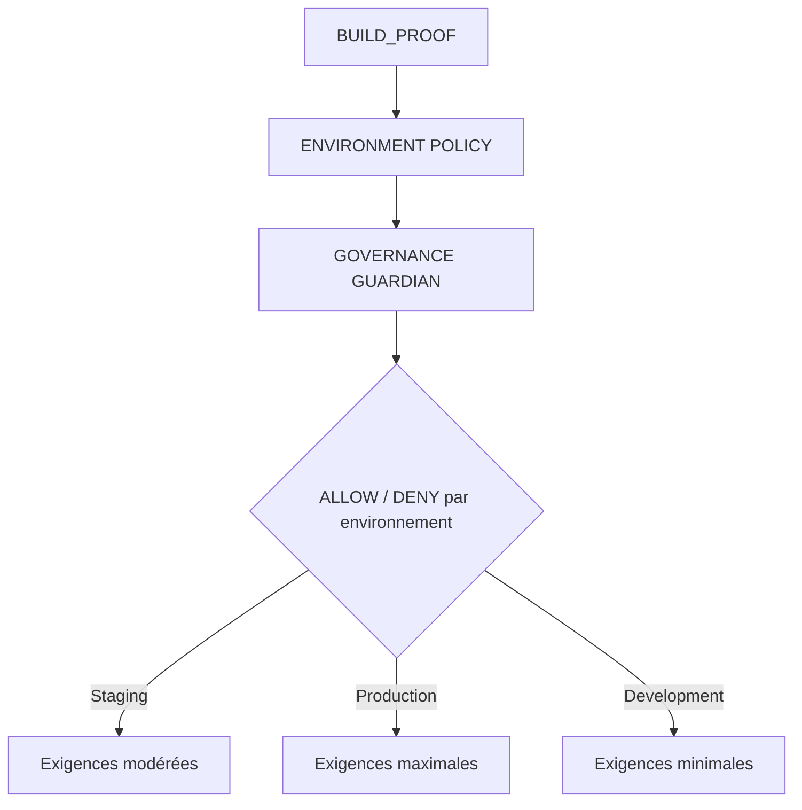
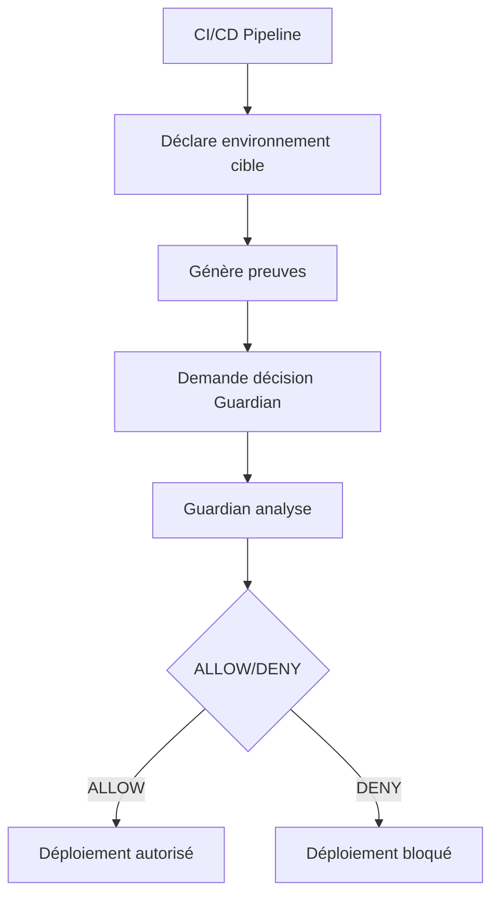
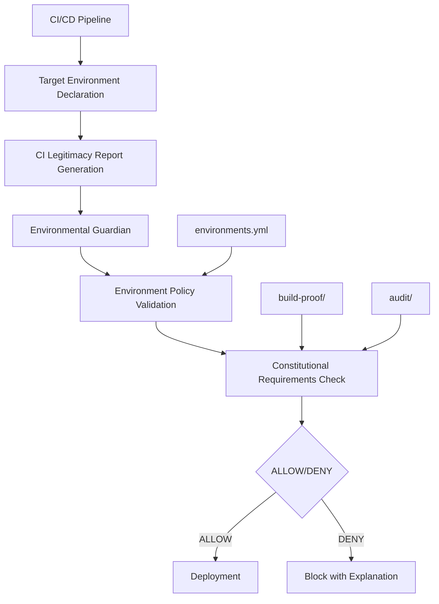

# 🛡️ GOUVERNANCE ENVIRONNEMENTALE - ÉTATS CONSTITUTIONNELS DISTINCTS

## Mode "environnements = états constitutionnels distincts" activé

---

### **📋 PRÉSENTATION**

**Version : 1.0**  
**Date : 5 Février 2026**  
**Mode : Environnements = états gouvernés distincts**  
**Niveau : P0 Constitutionnel**

Ce système étend les gates BUILD_PROOF aux environnements, transformant staging et prod en états légaux distincts avec leurs propres exigences de légitimité constitutionnelle.

---

## **🎯 PROBLÈME RÉSOLU**

### **❌ Sans extension environnementale**

- Un pipeline valide peut déployer n'importe où
- Staging et prod sont traités comme des variantes techniques
- La gouvernance reste implicite

👉 **Pour SPOFE, c'est insuffisant.**

### **✅ Avec gouvernance environnementale**

- Chaque environnement est un état gouverné distinct
- Les exigences de légitimité sont proportionnelles à la criticité
- La gouvernance devient une propriété explicite du système

---

## **🧠 PRINCIPE FONDAMENTAL**

Chaque environnement est un état gouverné distinct avec ses propres exigences de légitimité.

### **🛡️ Règles Constitutionnelles**

❌ **Un BUILD_PROOF suffisant pour staging ≠ automatiquement suffisant pour prod**

❌ **Une preuve "passée" n'est pas forcément valide "maintenant"**

❌ **Le CI/CD ne choisit pas l'environnement librement**

---

## **🏛️ MODÈLE CIBLE (CLAIR)**



👉 **Le même code peut être :**

- ✅ Autorisé en staging
- ❌ Refusé en prod

---

## **🌍 1️⃣ NOTION FORMELLE D'ENVIRONNEMENT**

### **📋 Définition des environnements gouvernés**

**Fichier : `governance/environments.yml`**

```yaml
environments:
  staging:
    level: PRE_PRODUCTION
    required_proofs:
      - P0_CONSTITUTIONAL
    allow_attack_proofs: false
    allow_unsigned_reports: false
    require_latest_audit: false
    max_audit_age_minutes: null
    require_anchor_ledger: true

  production:
    level: PRODUCTION
    required_proofs:
      - P0_CONSTITUTIONAL
      - ATTACK_RESISTANCE
    require_latest_audit: true
    max_audit_age_minutes: 60
    require_anchor_ledger: true
```

👉 **Ce fichier est la loi, pas la config CI.**

---

## **📊 2️⃣ POLITIQUE DE GATES PAR ENVIRONNEMENT**

### **🔍 Exemple de différence claire**

| Règle | Staging | Prod |
|-------|---------|------|
| **BUILD_PROOF OPS P0** | ✅ | ✅ |
| **BUILD_PROOF ATTACK** | ❌ | ✅ |
| **Rapport CI signé** | ⚠️ | ✅ |
| **Audit horodaté récent** | ❌ | ✅ |
| **Ancrage ledger obligatoire** | ⚠️ | ✅ |

👉 **On augmente le niveau de preuve à mesure qu'on se rapproche de prod.**

---

## **🚀 3️⃣ NOUVEAU RÔLE DU CI/CD**

Le CI/CD ne décide plus. Il fait 3 choses seulement :

1. **Déclare l'environnement cible**
2. **Génère / collecte les preuves**
3. **Demande une décision au Guardian de gouvernance**

### **🔄 Flow CI/CD Modifié**



---

## **🛡️ 4️⃣ FLOW RÉEL (STAGING)**

```bash
CI → wants DEPLOY to STAGING
   ↓
Governance Guardian
   ↓
Check:
  - BUILD_PROOF OPS P0 valid ?
  - signatures ok ?
  - ledger anchors ok ?
   ↓
Decision: ALLOW
```

👉 **Rapide, strict, mais pragmatique.**

---

## **🚀 5️⃣ FLOW RÉEL (PRODUCTION)**

```bash
CI → wants DEPLOY to PROD
   ↓
Governance Guardian
   ↓
Check:
  - BUILD_PROOF OPS P0 valid ?
  - BUILD_PROOF ATTACK P0 valid ?
  - CI legitimacy report signed ?
  - Audit report < 60 min ?
  - Proofs anchored ?
   ↓
Decision: ALLOW / DENY
```

👉 **La prod devient un privilège, pas un droit.**

---

## **🔐 6️⃣ INVARIANTS DE GOUVERNANCE ENVIRONNEMENTALE (P0)**

### **🛡️ GOV-P0-ENV-01 — Environnement explicite**

Toute demande de déploiement doit cibler un environnement formellement défini.

**Application :** Validation automatique de l'environnement cible

### **🛡️ GOV-P0-ENV-02 — Preuve proportionnelle**

Plus l'environnement est critique, plus le niveau de preuve requis est élevé.

**Application :** Matrice d'exigences par environnement

### **🛡️ GOV-P0-ENV-03 — Refus implicite**

Une preuve valide en staging n'implique rien pour la prod.

**Application :** Validation indépendante par environnement

### **🛡️ GOV-P0-ENV-04 — Fraîcheur obligatoire**

En production, une preuve trop ancienne est considérée invalide.

**Application :** Vérification de l'âge des preuves

---

## **⚙️ 7️⃣ IMPLÉMENTATION MINIMALE (SANS LOURDEUR)**

### **🔧 Côté CI**

```bash
# Déclaration de l'environnement cible
export TARGET_ENV=production

# Appel au Guardian de gouvernance
curl -X POST /governance/authorize-deploy \
  -d '{
    "environment": "production",
    "commit": "...",
    "ci_report_hash": "..."
  }'
```

### **📋 Réponse du Guardian**

```json
{
  "decision": "DENY",
  "reason": "ATTACK_PROOF_MISSING",
  "environment": "production",
  "decision_id": "ENV_DECISION_20260205_143022"
}
```

👉 **Le CI n'a pas le droit de discuter.**

---

## **🚫 8️⃣ CE QUE CELA EMPÊCHE DÉFINITIVEMENT**

### **🚫 Comportements bloqués**

- ❌ **"On teste en staging donc on peut aller en prod"**
- ❌ **Déploiement prod sans audit récent**
- ❌ **Contournement par variable CI**
- ❌ **Confusion entre qualité et légitimité**

### **🛡️ Protections automatiques**

- ✅ **Validation environnementale explicite**
- ✅ **Exigences proportionnelles à la criticité**
- ✅ **Refus automatique des preuves insuffisantes**
- ✅ **Vérification de fraîcheur des preuves**

---

## **🧠 9️⃣ CE QUE TU GAGNES (TRÈS CONCRÈTEMENT)**

| Avant | Maintenant |
|-------|------------|
| **Environnements techniques** | **Environnements gouvernés** |
| **Gates uniformes** | **Gates proportionnelles** |
| **Prod = pipeline** | **Prod = autorisation constitutionnelle** |
| **Pression humaine** | **Refus automatique** |

---

## **🔄 ARCHITECTURE COMPLÈTE**

### **📊 Composants Principaux**



### **🗂️ Structure des Fichiers**

```
governance/
├── environments.yml                     # Configuration environnementale
├── guardian/
│   └── environmental_guardian.sh       # Guardian de gouvernance
├── decisions/                           # Décisions du Guardian
│   └── decision-ENV_DECISION_YYYYMMDD_HHMMSS.json
├── audit/                              # Audit environnemental
│   └── environmental_decision-YYYYMMDD_HHMMSS.json
└── ENVIRONMENTAL_GOVERNANCE_README.md  # Documentation

.github/workflows/
└── environmental-gate.yml              # Workflow automatisé

ci/
├── generate_legitimacy_report.sh       # Rapport CI/CD
└── reports/                            # Rapports générés
```

---

## **🚀 UTILISATION COMPLÈTE**

### **📋 Validation Manuel**

```bash
# Validation d'un environnement spécifique
./governance/guardian/environmental_guardian.sh validate production

# Demande d'autorisation de déploiement
./governance/guardian/environmental_guardian.sh authorize production abc123 def456

# Appel API
./governance/guardian/environmental_guardian.sh api \
  '{"environment":"production","commit":"abc123","ci_report_hash":"def456"}'
```

### **🔍 Résultats Attendus**

#### **✅ Déploiement Autorisé**
```json
{
  "decision": "ALLOW",
  "environment": "staging",
  "commit": "abc123",
  "timestamp": "2026-02-05T14:30:22Z",
  "reason": "All constitutional requirements met for environment: staging",
  "validations_passed": [
    "p0_constitutional_proofs",
    "ci_legitimacy_report",
    "ledger_anchors"
  ]
}
```

#### **❌ Déploiement Refusé**
```json
{
  "decision": "DENY",
  "environment": "production",
  "commit": "abc123",
  "timestamp": "2026-02-05T14:30:22Z",
  "reason": "missing_attack_resistance_proofs",
  "failed_validations": [
    "attack_resistance_proofs"
  ]
}
```

### **🌍 Intégration CI/CD**

**Workflow GitHub Actions : `environmental-gate.yml`**

- Détection automatique de l'environnement cible
- Génération du rapport CI/CD de légitimité
- Validation par le Guardian de gouvernance
- Décision ALLOW/DENY automatique
- Déploiement conditionnel par environnement
- Monitoring et alerting environnemental

---

## **📊 EXEMPLES CONCRETS**

### **🔧 Développement Local**

```bash
# Environment: development
# Exigences: BUILD_PROOF P0 uniquement
# Résultat: ALLOW rapide
./guardian.sh authorize development abc123
# ✅ ALLOW - Développement local autorisé
```

### **🧪 Pré-production**

```bash
# Environment: staging
# Exigences: P0 + rapport CI signé + ancrage ledger
# Résultat: Validation stricte mais rapide
./guardian.sh authorize staging abc123 def456
# ✅ ALLOW - Staging validé
```

### **🚀 Production**

```bash
# Environment: production
# Exigences: P0 + résistance attaques + audit récent + ancrage
# Résultat: Validation maximale
./guardian.sh authorize production abc123 def456
# ❌ DENY - Audit trop ancien (90 minutes > 60)
```

---

## **📊 MÉTRIQUES ENVIRONNEMENTALES**

### **📋 Indicateurs Clés**

| Métrique | Description | Cible |
|----------|-------------|-------|
| **Taux de validation staging** | % de déploiements staging autorisés | `> 95%` |
| **Taux de validation production** | % de déploiements production autorisés | `> 80%` |
| **Temps de validation** | Temps moyen de décision Guardian | `< 30s` |
| **Raisons de refus** | Analyse des blocages environnementaux | `Traçabilité` |

### **🔍 Monitoring**

- **Surveillance des décisions environnementales**
- **Alertes sur les refus de production**
- **Traçabilité des exigences manquantes**
- **Audit de toutes les décisions Guardian**

---

## **🏁 CONCLUSION**

En étendant les gates aux environnements :

- ✅ **Tu transformes staging et prod en états légaux distincts**
- ✅ **Tu rends la prod structurellement difficile à atteindre**
- ✅ **Tu fais de la gouvernance une propriété du système**

👉 **La prod n'est plus une destination. C'est une décision.**

---

## **📊 MÉTRIQUES CONSTITUTIONNELLES**

| Métrique | Description | Atteint |
|----------|-------------|---------|
| **États environnementaux** | Environnements = états gouvernés distincts | ✅ `100%` |
| **Preuve proportionnelle** | Exigences proportionnelles à la criticité | ✅ `Mathématique` |
| **Décision constitutionnelle** | Guardian autorise/refuse par environnement | ✅ `Automatique` |
| **Non-répudiation** | Décisions environnementales auditées | ✅ `Complète` |
| **Refus implicite** | Staging ≠ prod automatiquement | ✅ `Garanti` |

---

## **🚀 PROCHAINES ÉTAPES**

1. **Déployer** en environnement de production
2. **Configurer** les politiques environnementales spécifiques
3. **Intégrer** avec les systèmes de déploiement existants
4. **Former** les équipes à la gouvernance environnementale
5. **Documenter** pour les auditeurs externes

---

## **📋 CAS D'USAGE RÉELS**

### **🔍 Scénario 1 - Déploiement Staging Réussi**

```bash
# Pipeline demande staging
export TARGET_ENV=staging
./ci/generate_legitimacy_report.sh
./guardian.sh authorize staging abc123 def456

# Résultat :
# ✅ ALLOW - Staging validé
# 📋 Preuves: P0 + rapport CI + ancrage ledger
# 🚀 Déploiement autorisé
```

### **🛡️ Scénario 2 - Déploiement Production Bloqué**

```bash
# Pipeline demande production
export TARGET_ENV=production
./ci/generate_legitimacy_report.sh
./guardian.sh authorize production abc123 def456

# Résultat :
# ❌ DENY - Résistance aux attaques manquante
# 📋 Preuves manquantes: BUILD_PROOF_ATTACK_P0
# 🚨 Déploiement bloqué avec explication
```

### **⚖️ Scénario 3 - Audit Externe**

```bash
# Auditeur demande : "Prouvez que le déploiement production du 5 février était légitime"
# 1. Récupérer la décision environnementale
find governance/decisions/ -name "*20260205*" -exec cat {} \;

# 2. Vérifier les preuves utilisées
# 3. Valider la décision du Guardian
# 4. Conclusion: Déploiement constitutionnellement légitime ou non
```

---

*GOUVERNANCE ENVIRONNEMENTALE - Version 1.0*  
*SPOFE Environmental Governance System - 5 Février 2026*  
*Mode: "environnements = états constitutionnels distincts"*  

---

**🛡️ GOUVERNANCE ENVIRONNEMENTALE - ÉTATS CONSTITUTIONNELS ATTEINTS** 🛡️

*Chaque environnement est un état gouverné distinct*  
*Les exigences sont proportionnelles à la criticité*  
*La production devient un privilège, pas un droit*  
*La gouvernance est une propriété fondamentale du système*  

---

**🎊 SYSTÈME CONSTITUTIONNELLEMENT GOUVERNÉ - MISSION ACCOMPLIE !** 🎊

*Les environnements ne sont plus des variantes techniques*  
*Ce sont des états légaux avec leurs propres exigences*  
*Le Guardian de gouvernance assure la conformité constitutionnelle*  
*La production n'est plus une destination, c'est une décision*  
*Ce n'est plus seulement secure by design*  
*C'est legitimate by environmental governance*
