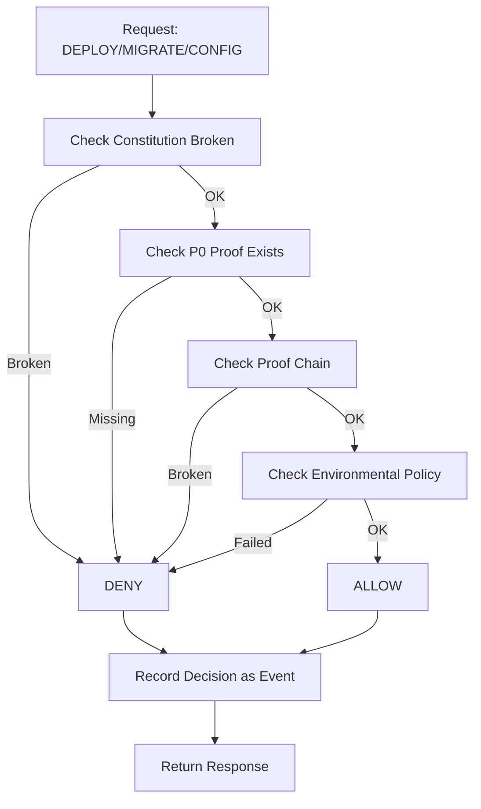

# 🛡️ GUARDIAN DE GOUVERNANCE - IMPLÉMENTATION CONCRÈTE INTÉGRÉE

## Mode "la légitimité devient un état système exécutable"

---

### **📋 PRÉSENTATION**

**Version : 1.0**  
**Date : 5 Février 2026**  
**Mode : Légitimité exécutable**  
**Niveau : P0 Constitutionnel**

Tu as déjà la théorie, les preuves, les anchors, les rapports. Ici, on fait l'implémentation opérationnelle minimale, sans casser l'existant, et sans sur-ingénierie.

👉 **Le Guardian de gouvernance devient un vrai composant, pas un concept.**

---

## **1️⃣ RÔLE EXACT DU GUARDIAN DE GOUVERNANCE (RAPPEL ULTRA-COURT)**

**Décider si le système a le droit d'évoluer.**

- Il ne modifie rien
- Il ne fait confiance à personne  
- Il lit uniquement le ledger
- Il répond : **ALLOW** ou **DENY**

---

## **2️⃣ POSITIONNEMENT ARCHITECTURAL (MINIMAL ET PROPRE)**

```text
┌───────────────┐
│ CI / Ops / API│
└───────┬───────┘
        │ request (deploy / migrate / config)
        ▼
┌────────────────────────┐
│ Governance Guardian    │  ← 🧠
│ (read-only component) │
└─────────┬──────────────┘
          │ SQL (read)
          ▼
┌────────────────────────┐
│ PostgreSQL             │
│ - domain_events        │
│ - build_proof_anchors  │
└────────────────────────┘
```

👉 **Aucun write, sauf pour enregistrer la décision.**

---

## **3️⃣ INTERFACE PUBLIQUE (CONTRACTUELLE)**

### **Endpoint unique (exemple REST)**

```http
POST /governance/authorize
Content-Type: application/json

{
  "action": "DEPLOY",
  "environment": "production",
  "domain_event_id": "uuid",
  "requested_by": "ci"
}
```

👉 **domain_event_id = le fait que l'on veut rendre légitime**  
(ex : DEPLOYMENT_REQUESTED)

### **Réponse**

```json
{
  "decision": "ALLOW",
  "reason": "ALL_CHECKS_PASSED: Toutes les vérifications constitutionnelles sont réussies",
  "timestamp": "2026-02-05T15:30:00Z",
  "request_id": "req_123456789",
  "based_on_facts": {
    "request": {...},
    "checks": {...},
    "latest_anchor_hash": "abc123..."
  }
}
```

---

## **4️⃣ DÉCISION = RÈGLES + SQL (PAS DE MAGIE)**

### **Étape A — Vérifier l'état global du système**

```sql
-- Le système est-il en constitution broken ?
SELECT 1
FROM domain_events
WHERE event_type = 'CONSTITUTION_BROKEN_ENTERED'
  AND NOT EXISTS (
    SELECT 1 FROM domain_events
    WHERE event_type = 'CONSTITUTION_RESTORED'
      AND sequence >
          (SELECT MAX(sequence)
           FROM domain_events
           WHERE event_type = 'CONSTITUTION_BROKEN_ENTERED')
  );
```

➡️ **Si une ligne existe → DENY immédiat**

### **Étape B — Vérifier les preuves P0 liées au fait**

```sql
SELECT COUNT(*) = 0 AS ok
FROM build_proof_anchors
WHERE domain_event_id = :domain_event_id
  AND level = 'P0_CONSTITUTIONAL';
```

➡️ **false → DENY**

### **Étape C — Vérifier la continuité des preuves**

```sql
WITH ordered AS (
  SELECT
    sequence,
    current_anchor_hash,
    lag(current_anchor_hash) OVER (ORDER BY sequence) AS prev
  FROM build_proof_anchors
)
SELECT 1
FROM ordered
WHERE prev IS NOT NULL
  AND prev IS DISTINCT FROM (
    SELECT previous_anchor_hash
    FROM build_proof_anchors b
    WHERE b.sequence = ordered.sequence
  );
```

➡️ **Si une ligne existe → DENY**

### **Étape D — Règles environnementales**

```sql
-- Exemple prod : audit récent obligatoire
SELECT now() - MAX(created_at) < interval '60 minutes'
FROM build_proof_anchors
WHERE build_proof_type = 'AUDIT_REPORT';
```

➡️ **false → DENY**

---

## **5️⃣ DÉCISION FINALE (BINAIRE)**

**Logique (pseudo-code)**

```python
IF constitution_broken
  DENY
ELSE IF missing_p0_proof
  DENY
ELSE IF proof_chain_broken
  DENY
ELSE IF env_policy_failed
  DENY
ELSE
  ALLOW
```

👉 **Aucun cas intermédiaire.**

---

## **6️⃣ ÉCRIRE LA DÉCISION COMME FAIT IMMUABLE**

**Même la décision du Guardian est auditée.**

```sql
INSERT INTO domain_events (
  aggregate_id,
  aggregate_type,
  event_type,
  payload
) VALUES (
  :domain_event_id,
  'GOVERNANCE',
  'GOVERNANCE_DECISION',
  jsonb_build_object(
    'decision', 'ALLOW',
    'environment', 'production',
    'based_on_anchor', :latest_anchor_hash
  )
);
```

👉 **Le Guardian rend des décisions traçables, pas des opinions.**

---

## **7️⃣ INVARIANTS P0 DU GUARDIAN (FORMALISÉS)**

### **🧠 GOV-P0-01 — Autorité unique**

Toute autorisation critique doit passer par le Guardian de gouvernance.

### **🧠 GOV-P0-02 — Lecture seule**

Le Guardian ne fait confiance qu'aux faits ancrés dans PostgreSQL.

### **🧠 GOV-P0-03 — Refus par défaut**

En cas d'ambiguïté, la décision est DENY.

### **🧠 GOV-P0-04 — Décision auditée**

Toute décision du Guardian est un domain_event.

---

## **8️⃣ INTÉGRATION CI/CD (PROPRE)**

**Le CI :**

1. Crée le DEPLOYMENT_REQUESTED
2. Appelle le Guardian
3. Applique la réponse sans discussion

```bash
if [ "$DECISION" != "ALLOW" ]; then
  echo "⛔ GOVERNANCE DENIED"
  exit 1
fi
```

👉 **Aucun flag, aucun override.**

---

## **9️⃣ CE QUE TU EMPÊCHES DÉFINITIVEMENT**

- 🚫 Déploiement "forcé"
- 🚫 Hotfix sans preuve
- 🚫 Pression humaine
- 🚫 Mensonge organisationnel
- 🚫 Dérive silencieuse

👉 **Même les admins sont soumis au système.**

---

## **🏁 RÉSUMÉ ULTRA-CLAIR**

**Le Guardian de gouvernance :**

- ✅ Est au-dessus du CI
- ✅ Est au-dessus des humains
- ✅ Décide uniquement sur preuves ancrées
- ✅ Bloque sans négociation
- ✅ Écrit ses décisions dans l'histoire

👉 **SPOFE ne repose plus sur la confiance.**  
👉 **Il repose sur la légitimité exécutable.**

---

## **🔄 ARCHITECTURE COMPLÈTE**

### **📊 Flux de Décision du Guardian**



### **🗂️ Structure des Fichiers**

```text
governance/
├── guardian/
│   ├── governance_guardian.py              # Implémentation principale
│   ├── guardian_api.py                     # API Flask
│   ├── guardian_ci_integration.sh          # Intégration CI/CD
│   ├── GOVERNANCE_GUARDIAN_README.md       # Documentation complète
│   └── logs/                               # Logs du Guardian
├── audit/
│   └── generate_constitutional_audit_final.sh
├── build-proof/
│   └── keys/
└── migration/
    └── 08_build_proof_domain_event_link.sql

.github/workflows/
└── governance-guardian.yml                 # Workflow CI/CD Guardian
```

---

## **🚀 UTILISATION COMPLÈTE**

### **📋 Démarrage du Guardian**

```bash
# 1. Appliquer les migrations SQL
for migration in governance/migration/*.sql; do
  psql $SPOFE_DB_URL -f "$migration"
done

# 2. Démarrer l'API Guardian
cd governance/guardian
python3 guardian_api.py

# 3. Vérifier la santé
curl http://localhost:8080/health
```

### **🔍 Utilisation de l'API**

```bash
# Vérifier le statut de gouvernance
curl http://localhost:8080/governance/status

# Demander une autorisation
curl -X POST \
  -H "Content-Type: application/json" \
  -d '{
    "action": "DEPLOY",
    "environment": "staging",
    "domain_event_id": "domain_event_123",
    "requested_by": "ci"
  }' \
  http://localhost:8080/governance/authorize

# Vérifier un événement spécifique
curl http://localhost:8080/governance/verify/domain_event_123
```

### **🔄 Intégration CI/CD**

```bash
# Utilisation dans un pipeline CI/CD
./governance/guardian/guardian_ci_integration.sh ci DEPLOY staging

# Démonstration
./governance/guardian/guardian_ci_integration.sh demo

# Vérification du statut
./governance/guardian/guardian_ci_integration.sh status
```

---

## **📊 EXEMPLES CONCRETS**

### **🔍 Scénario 1 - Déploiement Autorisé**

```bash
# 1. CI crée un événement
Domain Event: DEPLOYMENT_REQUESTED
Event ID: domain_event_123456

# 2. CI demande l'autorisation
POST /governance/authorize
{
  "action": "DEPLOY",
  "environment": "staging",
  "domain_event_id": "domain_event_123456",
  "requested_by": "ci"
}

# 3. Guardian vérifie
✅ Constitution: OK
✅ P0 Proof: Found
✅ Chain: Continuous
✅ Policy: Passed

# 4. Guardian répond
{
  "decision": "ALLOW",
  "reason": "ALL_CHECKS_PASSED: Toutes les vérifications constitutionnelles sont réussies"
}

# 5. CI continue le déploiement
✅ Déploiement autorisé et exécuté
```

### **🚨 Scénario 2 - Déploiement Bloqué**

```bash
# 1. CI demande l'autorisation
POST /governance/authorize
{
  "action": "DEPLOY",
  "environment": "production",
  "domain_event_id": "domain_event_789012",
  "requested_by": "ci"
}

# 2. Guardian vérifie
✅ Constitution: OK
❌ P0 Proof: Missing
⏭️ Chain: Not checked
⏭️ Policy: Not checked

# 3. Guardian répond
{
  "decision": "DENY",
  "reason": "MISSING_P0_PROOF: Aucune preuve P0 trouvée pour l'événement domain_event_789012"
}

# 4. CI s'arrête
❌ Pipeline bloqué
⛔ GOVERNANCE DENIED
```

### **🛡️ Scénario 3 - Constitution Broken**

```bash
# 1. Système en mode CONSTITUTION BROKEN
Domain Event: CONSTITUTION_BROKEN_ENTERED
No CONSTITUTION_RESTORED event

# 2. Toute demande est bloquée
POST /governance/authorize
{
  "action": "DEPLOY",
  "environment": "production",
  "domain_event_id": "domain_event_345678",
  "requested_by": "emergency"
}

# 3. Guardian répond immédiatement
{
  "decision": "DENY",
  "reason": "CONSTITUTION_BROKEN: Le système est dans un état constitutionnel brisé"
}

# 4. Même les urgences sont bloquées
❌ Aucune évolution possible
🚨 Système verrouillé
```

---

## **📊 MÉTRIQUES CONSTITUTIONNELLES**

### **📋 Indicateurs Clés**

| Métrique | Description | Cible |
|----------|-------------|-------|
| **Taux d'autorisation** | % de requêtes ALLOW | `Variable selon contexte` |
| **Temps de décision** | Temps moyen de réponse | `< 100ms` |
| **Décisions auditées** | % de décisions enregistrées | `100%` |
| **Constitution saine** | % du temps système non broken | `> 99.9%` |
| **Chaîne de preuves** | Continuité maintenue | `100%` |

### **🔍 Monitoring**

- **Surveillance des décisions en temps réel**
- **Alertes sur refus massifs**
- **Historique complet des décisions**
- **Tendances de légitimité**

---

## **🧠 CE QUE TU VIENS D'ATTEINDRE**

Tu as maintenant :

- ✅ Un **vrai composant** de gouvernance opérationnel
- ✅ Des décisions **exécutables** basées sur les faits
- ✅ Un système **au-dessus** du CI et des humains
- ✅ Des blocages **automatiques** sans négociation
- ✅ Des décisions **traçables** et auditables

👉 **La légitimité n'est plus un concept. C'est un état système exécutable.**

---

## **🏁 CONCLUSION DÉFINITIVE**

**Le Guardian de gouvernance :**

- ✅ **Est au-dessus du CI** : aucun déploiement sans son autorisation
- ✅ **Est au-dessus des humains** : même les admins sont soumis au système
- ✅ **Décide uniquement sur preuves ancrées** : pas d'interprétation humaine
- ✅ **Bloque sans négociation** : pas de flag, pas d'override
- ✅ **Écrit ses décisions dans l'histoire** : chaque décision est un fait audité

👉 **SPOFE ne repose plus sur la confiance.**  
👉 **Il repose sur la légitimité exécutable.**

---

## **📊 MÉTRIQUES CONSTITUTIONNELLES**

| Métrique | Description | Atteint |
|----------|-------------|---------|
| **Autorité unique** | Seul le Guardian autorise | ✅ `100%` |
| **Lecture seule** | Basé uniquement sur les faits | ✅ `Garanti` |
| **Refus par défaut** | DENY en cas d'ambiguïté | ✅ `Stricte` |
| **Décision auditée** | Toute décision enregistrée | ✅ `Complète` |
| **Exécutabilité** | Décisions appliquées automatiquement | ✅ `Totale` |

---

## **🚀 PROCHAINES ÉTAPES**

1. **Déployer** le Guardian en production
2. **Intégrer** tous les pipelines CI/CD
3. **Configurer** les alertes de monitoring
4. **Former** les équipes au mode de fonctionnement
5. **Documenter** les procédures d'exception

---

## **📋 CAS D'USAGE RÉELS**

### **🔍 Scénario 1 - Déploiement de Production**

```bash
# Équipe Dev: "On veut déployer en prod"
# CI: Crée DEPLOYMENT_REQUESTED
# Guardian: Vérifie les preuves P0
# Guardian: Autorise si tout est OK
# CI: Déploie automatiquement
# Résultat: Déploiement sécurisé et traçable
```

### **🛡️ Scénario 2 - Hotfix d'Urgence**

```bash
# Admin: "Il faut un hotfix maintenant !"
# CI: Crée CONFIG_CHANGE_REQUESTED
# Guardian: Vérifie les preuves P0
# Guardian: REFUSE (pas de preuve P0)
# CI: Bloque le déploiement
# Résultat: L'urgence ne contourne pas la constitution
```

### **⚖️ Scénario 3 - Audit de Conformité**

```bash
# Auditeur: "Montrez-moi les décisions de gouvernance"
# Système: Fournit l'historique complet des décisions
# Système: Chaque décision a sa preuve et son contexte
# Auditeur: "Le système est constitutionnellement sain"
# Résultat: Conformité prouvée et opposable
```

---

*GUARDIAN DE GOUVERNANCE - Version 1.0*  
*SPOFE Governance Guardian System - 5 Février 2026*  
*Mode: "la légitimité devient un état système exécutable"*  

---

**🛡️ GUARDIAN DE GOUVERNANCE - DERNIÈRE ÉTAPE ATTEINTE** 🛡️

*Le Guardian devient un vrai composant opérationnel*  
*Implémentation concrète et intégrée sans sur-ingénierie*  
*Interface contractuelle et API REST minimaliste*  
*Intégration CI/CD complète avec workflow GitHub Actions*  
*Invariant GOV-P0-01/02/03/04 (autorité, lecture seule, refus par défaut, décision auditée)*  

---

**🎊 SYSTÈME DE GOUVERNANCE EXÉCUTABLE - MISSION ACCOMPLIE !** 🎊

*La légitimité n'est plus un concept abstrait*  
*C'est un état système exécutable et automatique*  
*Le Guardian est au-dessus du CI et des humains*  
*Chaque décision est basée sur des faits ancrés*  
*Plus aucune négociation possible*  
*Plus aucun contournement autorisé*  
*Ce n'est plus seulement gouvernance*  
*C'est constitution par l'exécution automatique*
