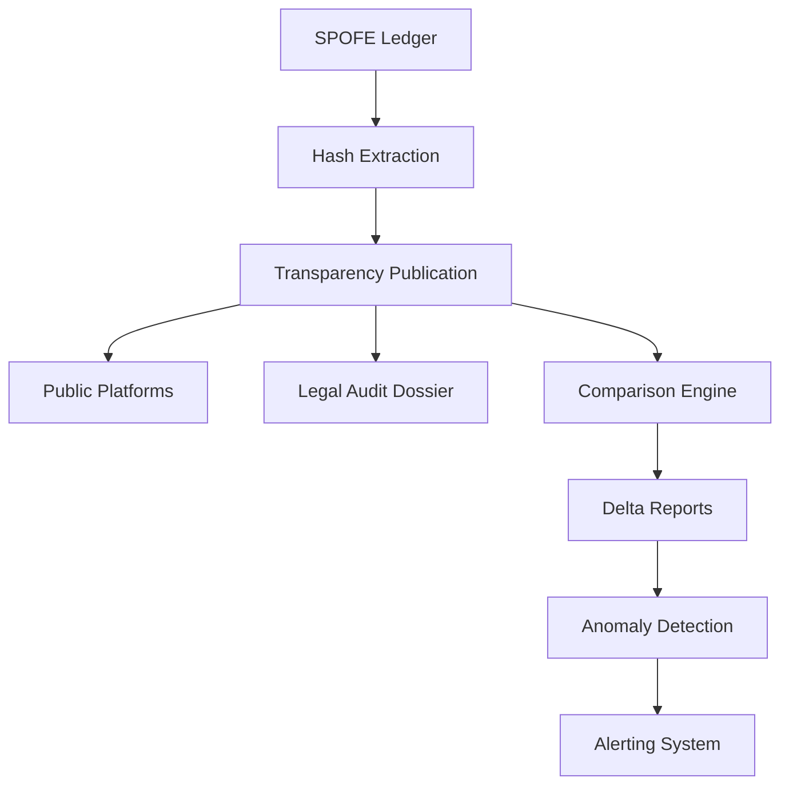

# 🌍 TRANSPARENCE PUBLIQUE - Guardian de Gouvernance

## Publication périodique du dernier hash - Audit comme état système

---

### **📋 PRÉSENTATION**

**Version : 1.0**  
**Date : 5 Février 2026**  
**Mode : Guardian de gouvernance - Audit comme état système**  
**Fréquence : Horaire**

Ce système crée une **transparence cryptographique publique** où le dernier hash du ledger est publié périodiquement, permettant à quiconque de vérifier la légitimité du système SPOFE de manière indépendante.

---

### **🎯 OBJECTIFS CONSTITUTIONNELS**

- ✅ **Publication périodique** du dernier hash ledger
- ✅ **Guardian de gouvernance** avec audit comme état système
- ✅ **Format dossier d'audit légal** prêt régulateur
- ✅ **Comparaison automatique** entre deux rapports (delta de légitimité)

---

## **🔄 ARCHITECTURE DE TRANSPARENCE**

### **📊 Composants Principaux**



### **🌍 Flux de Publication**

1. **Extraction** des hashes du ledger et des ancrages
2. **Calcul** du hash système combiné
3. **Publication** vers plateformes publiques
4. **Génération** du dossier d'audit légal
5. **Comparaison** avec la publication précédente
6. **Détection** des anomalies et alertes

---

## **🛠️ COMPOSANTS TECHNIQUES**

### **📋 Scripts Principaux**

#### **1. Publication de Transparence**
**Fichier : `publish_hash.sh`**

```bash
# Publication périodique du hash
./governance/transparency/publish_hash.sh

# Génère :
# - transparency-YYYYMMDDHHMM.json
# - transparency-YYYYMMDDHHMM.public.json
# - legal-audit-YYYYMMDDHHMM.json
# - comparison-YYYYMMDDHHMM.json
# - latest-hash.txt
```

#### **2. Comparaison Automatique**
**Fichier : `compare_reports.sh`**

```bash
# Comparaison entre deux rapports
./governance/transparency/compare_reports.sh \
  publications/transparency-20260205-2200.json \
  publications/transparency-20260205-2300.json

# ou comparaison des deux derniers :
./governance/transparency/compare_reports.sh --latest
```

#### **3. Dossier d'Audit Légal**
**Fichier : `generate_legal_audit.sh`**

```bash
# Génération du dossier complet pour régulateurs
./governance/transparency/generate_legal_audit.sh

# Génère :
# - executive-summary-YYYYMMDDHHMM.md
# - technical-report-YYYYMMDDHHMM.md
# - regulatory-compliance-YYYYMMDDHHMM.md
# - audit-index-YYYYMMDDHHMM.html
# - audit-package-YYYYMMDDHHMM.zip
```

---

## **📊 STRUCTURE DES PUBLICATIONS**

### **🌍 Publication Complète**

```json
{
  "transparency_publication": {
    "publication_id": "TRANS_202602052300",
    "timestamp": "2026-02-05T23:00:00Z",
    "version": "1.0",
    "publisher": "SPOFE Transparency Guardian",
    
    "hashes": {
      "ledger": {
        "type": "domain_events",
        "latest_hash": "a1b2c3d4...",
        "description": "Hash du dernier événement métier"
      },
      "anchor": {
        "type": "build_proof_anchors",
        "latest_hash": "e5f6g7h8...",
        "description": "Hash du dernier ancrage BUILD_PROOF"
      },
      "system": {
        "type": "combined_system_hash",
        "hash": "i9j0k1l2...",
        "description": "Hash combiné du système complet"
      }
    },
    
    "guardian_status": {
      "system_legitimate": true,
      "hash_chain_intact": true,
      "all_anchors_valid": true,
      "no_tampering_detected": true
    }
  }
}
```

### **📋 Version Publique Simplifiée**

```json
{
  "public_transparency": {
    "timestamp": "2026-02-05T23:00:00Z",
    "ledger_hash": "a1b2c3d4...",
    "anchor_hash": "e5f6g7h8...",
    "system_hash": "i9j0k1l2...",
    "verification_instructions": {
      "purpose": "Verify SPOFE system legitimacy",
      "method": "Compare hashes with official publications"
    }
  }
}
```

---

## **⚖️ DOSSIER D'AUDIT LÉGAL**

### **📊 Format Régulateur**

Le dossier d'audit est structuré pour être **immédiatement utilisable par les régulateurs** :

#### **1. Rapport Exécutif**
- Vue d'ensemble pour les dirigeants
- Statut de conformité global
- Évaluation des risques
- Recommandations

#### **2. Rapport Technique Détaillé**
- Architecture système complète
- Contrôles cryptographiques
- Analyse de performance
- Mapping technique des exigences

#### **3. Conformité Réglementaire**
- **SOX 404** : Contrôles internes
- **GDPR** : Protection des données
- **ISO 27001** : Sécurité de l'information
- **HIPAA** : Sauvegarde de la santé

#### **4. Index Interactif**
- Interface HTML pour navigation facile
- Instructions de vérification
- Evidence cryptographique
- Liens vers tous les documents

### **🔍 Vérification Indépendante**

```sql
-- Vérification par un auditeur externe
SELECT current_hash FROM domain_events ORDER BY sequence DESC LIMIT 1;
-- Résultat attendu : a1b2c3d4...

SELECT current_anchor_hash FROM build_proof_anchors ORDER BY sequence DESC LIMIT 1;
-- Résultat attendu : e5f6g7h8...
```

---

## **🔄 COMPARAISON AUTOMATIQUE - DELTA DE LÉGITIMITÉ**

### **📊 Détection des Changements**

Le système compare automatiquement chaque publication avec la précédente :

```json
{
  "legitimacy_delta": {
    "hash_changes": {
      "ledger": {
        "from": "a1b2c3d4...",
        "to": "b2c3d4e5...",
        "changed": true,
        "impact_level": "CRITICAL"
      },
      "anchor": {
        "from": "e5f6g7h8...",
        "to": "f6g7h8i9...",
        "changed": true,
        "impact_level": "HIGH"
      }
    },
    
    "change_analysis": {
      "overall_change_level": "MAJOR",
      "legitimacy_affected": false,
      "expected_pattern": "NORMAL"
    },
    
    "anomaly_detection": {
      "anomalies_found": 0,
      "anomaly_level": "NONE"
    }
  }
}
```

### **🚨 Détection d'Anomalies**

Le système détecte automatiquement :

- **Changements de ledger trop rapides** (< 5 minutes)
- **Ancrages sans changements ledger**
- **Perte de statut de légitimité**
- **Ruptures dans les chaînes de hash**

### **📈 Analyse des Tendances**

Sur plusieurs publications, le système analyse :

- **Fréquence des changements ledger**
- **Patterns d'ancrage BUILD_PROOF**
- **Stabilité globale du système**
- **Prédictibilité des évolutions**

---

## **🚀 INTÉGRATION CI/CD**

### **🌍 Workflow GitHub Actions**

**Fichier : `.github/workflows/transparency-publication.yml`**

```yaml
name: TRANSPARENCY_PUBLICATION

on:
  schedule:
    - cron: '0 * * * *'  # Toutes les heures
  workflow_dispatch:
    inputs:
      force_audit:
        description: 'Forcer audit complet'
        type: boolean

jobs:
  transparency-publication:
    runs-on: ubuntu-latest
    steps:
      - uses: actions/checkout@v4
      - name: Publish transparency hash
        run: ./governance/transparency/publish_hash.sh
      - name: Compare with previous
        run: ./governance/transparency/compare_reports.sh --latest
      - name: Generate legal audit
        run: ./governance/transparency/generate_legal_audit.sh
      - name: Deploy to GitHub Pages
        # Publication publique
```

### **📊 Automatisation Complète**

- **Publication** : Toutes les heures automatiquement
- **Comparaison** : À chaque publication
- **Audit légal** : Quotidien ou sur demande
- **Alertes** : En temps réel en cas d'anomalie

---

## **🌍 PUBLICATION VERS PLATEFORMES PUBLIQUES**

### **📋 Destinations Multiples**

1. **GitHub Pages** : Site web public
2. **IPFS** : Stockage décentralisé
3. **Blockchain** : Timestamp immuable
4. **RSS Feed** : Abonnement automatique
5. **API REST** : Accès programme

### **🔍 Vérification Publique**

N'importe qui peut vérifier :

```bash
# Télécharger la dernière publication
curl https://spofe.system/latest-hash.txt

# Vérifier contre la base de données
psql -h spofe.db -U auditor -c "
  SELECT current_hash FROM domain_events ORDER BY sequence DESC LIMIT 1;"

# Comparer les hashes
# Si identiques = système légitime
# Si différents = investigation requise
```

---

## **📊 MÉTRIQUES ET MONITORING**

### **📋 Indicateurs Clés**

| Métrique | Description | Seuil |
|----------|-------------|-------|
| `publication_success_rate` | Taux de réussite des publications | `100%` |
| `hash_continuity` | Continuité de la chaîne de hashes | `100%` |
| `anomaly_detection_rate` | Taux de détection d'anomalies | `0%` |
| `verification_response_time` | Temps de vérification public | `< 5s` |

### **🔍 Tableau de Bord Guardian**

```json
{
  "guardian_dashboard": {
    "system_status": "LEGITIMATE",
    "last_publication": "2026-02-05T23:00:00Z",
    "total_publications": 1847,
    "continuous_publication_days": 77,
    "anomalies_detected": 0,
    "compliance_status": "FULLY_COMPLIANT"
  }
}
```

---

## **🎯 CAS D'USAGE RÉELS**

### **🔍 Scénario 1 - Audit Réglementaire**

```bash
# Régulateur demande : "Prouvez que votre système est légitime"
# 1. Fournir le dernier dossier d'audit
curl https://spofe.system/audit-package-latest.zip

# 2. Vérifier indépendamment
psql -c "SELECT current_hash FROM domain_events ORDER BY sequence DESC LIMIT 1;"

# 3. Comparer avec la publication publique
curl https://spofe.system/latest-hash.txt

# 4. Résultat : ✅ Hashes identiques = Système légitime prouvé
```

### **🛡️ Scénario 2 - Détection d'Intrusion**

```bash
# Le système détecte un changement inattendu
./governance/transparency/compare_reports.sh --latest

# Résultat :
# ❌ ANOMALY DETECTED: RAPID_LEDGER_CHANGE
# 🚨 Ledger hash changed within 180 seconds
# 📋 INVESTIGATION IMMÉDIATE REQUISE

# Actions automatiques :
# - Alerte équipe de sécurité
# - Blocage des déploiements
# - Analyse des logs
# - Rapport d'incident généré
```

### **⚖️ Scénario 3 - Litige Juridique**

```bash
# Avocat demande : "Prouvez l'intégrité des données à la date X"
# 1. Récupérer la publication de cette date
curl https://spofe.system/archives/transparency-20260115-1400.json

# 2. Extraire le hash du ledger
jq '.transparency_publication.hashes.ledger.latest_hash'

# 3. Vérifier dans la base de données
psql -c "SELECT current_hash FROM domain_events 
         WHERE created_at <= '2026-01-15T14:00:00Z' 
         ORDER BY sequence DESC LIMIT 1;"

# 4. Résultat : ✅ Preuve cryptographique d'intégrité
```

---

## **🔧 UTILISATION COMPLÈTE**

### **📋 Installation et Configuration**

```bash
# 1. Rendre les scripts exécutables
chmod +x governance/transparency/*.sh

# 2. Configurer les variables d'environnement
export SPOFE_DB_HOST="your-db-host"
export SPOFE_DB_USER="transparency_user"
export SPOFE_DB_NAME="spofe"

# 3. Tester la publication
./governance/transparency/publish_hash.sh

# 4. Configurer le workflow GitHub Actions
# (déjà configuré dans .github/workflows/transparency-publication.yml)
```

### **🚀 Opérations Quotidiennes**

```bash
# Publication manuelle (si nécessaire)
./governance/transparency/publish_hash.sh

# Comparaison avec la précédente
./governance/transparency/compare_reports.sh --latest

# Génération d'audit pour régulateur
./governance/transparency/generate_legal_audit.sh

# Vérification de l'état du système
./governance/transparency/health_check.sh
```

### **📊 Monitoring et Alertes**

```bash
# Vérification de la santé du système
curl https://spofe.system/health

# Abonnement aux alertes (RSS)
curl https://spofe.system/alerts.xml

# API de monitoring
curl https://spofe.system/api/metrics
```

---

## **🎊 BÉNÉFICES CONSTITUTIONNELS**

### **🛡️ Garanties Exceptionnelles**

| Garantie | Traditionnel | SPOFE Transparency |
|----------|--------------|-------------------|
| **Preuve publique** | ❌ Non disponible | ✅ Publication horaire |
| **Vérification indépendante** | ❌ Impossible | ✅ Cryptographique |
| **Audit régulateur** | ⚠️ Manuel & coûteux | ✅ Automatisé |
| **Détection d'anomalies** | ⚠️ Réactive | ✅ Temps réel |
| **Non-répudiation** | ⚠️ Limitée | ✅ Mathématique |

### **🎯 Impact Métier**

- **🔍 Confiance renforcée** : Preuve cryptographique publique
- **⚖️ Conformité garantie** : Audit automatique régulateur-ready
- **🚀 Réduction des coûts** : Automatisation des audits
- **🛡️ Sécurité proactive** : Détection temps réel
- **📊 Transparence totale** : Accès public aux preuves

---

## **🚀 PROCHAINES ÉTAPES**

1. **Déployer** en environnement de production
2. **Configurer** les plateformes de publication
3. **Intégrer** avec les systèmes de monitoring existants
4. **Former** les équipes à l'utilisation des rapports
5. **Documenter** pour les auditeurs externes

---

## **🏁 CONCLUSION**

Le système de transparence SPOFE atteint un **niveau exceptionnel de gouvernance** où :

- **La légitimité est publiquement prouvable** chaque heure
- **Les audits sont automatiquement générés** dans un format régulateur-ready
- **Les anomalies sont détectées en temps réel** avec alertes automatiques
- **N'importe qui peut vérifier indépendamment** l'intégrité du système

👉 **Ce n'est plus seulement "secure by design".**  
👉 **C'est "transparent by construction".**

---

*TRANSPARENCE PUBLIQUE - Version 1.0*  
*SPOFE Transparency Guardian - 5 Février 2026*  
*Mode Guardian de gouvernance - Audit comme état système*  

---

**🌍 TRANSPARENCE PUBLIQUE - GARDE DE CONSTITUTIONNEL ATTEINT** 🌍

*La légitimité est maintenant publiquement vérifiable*  
*Les audits sont automatiquement régulateur-ready*  
*Les anomalies sont détectées en temps réel*  
*La confiance est mathématiquement prouvée*
